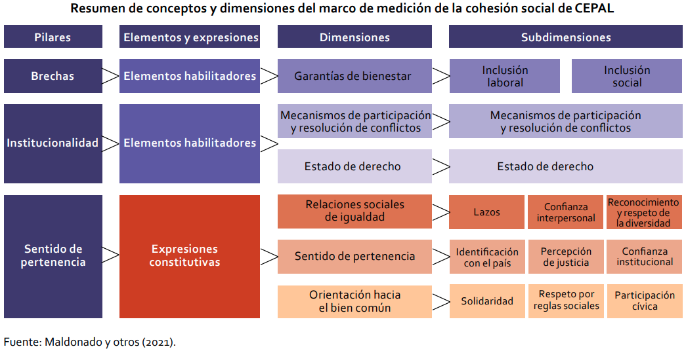
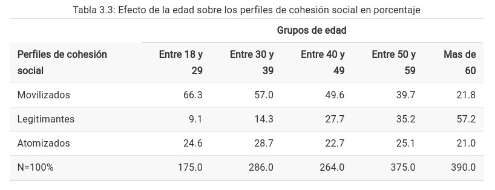
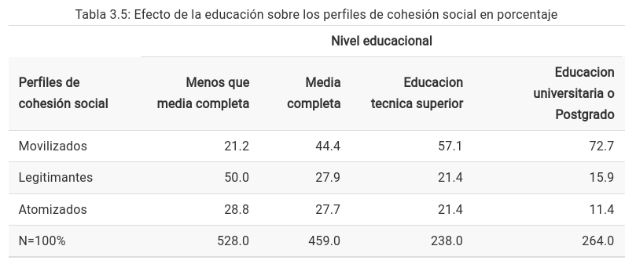
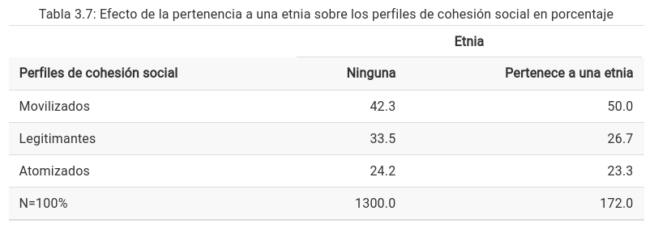
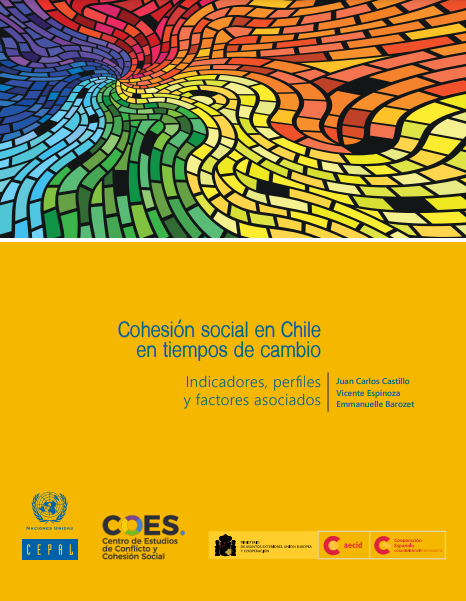

background-image: url(images/covercepalelsoc.png)
background-size: contain
class: middle hide-logo title

---

```{r xaringanExtra, echo=FALSE}
xaringanExtra::use_xaringan_extra(c("tile_view", "animate_css"))
```

layout: true
class: animated, fadeIn

---
class: inverse bottom center
Disponible en:

[ocscoes.github.io/presentaciones/CEPAL2022cohesionELSOC.html
](https://ocscoes.github.io/presentaciones/CEPAL2022cohesionELSOC.html)
---
class: inverse right bottom

# 1.Contexto

# 2.El informe  

# 3.Proyecciones 


---
class: inverse right bottom

.pull-left-narrow[

]

.pull-right-wide[
.content-box-gray[
# .red[1.Contexto]
]

# 2.El informe

# 3.Proyecciones]

---
<div style="position: relative; width: 100%; height: 0; padding-top: 56.2500%;
 padding-bottom: 48px; box-shadow: 0 2px 8px 0 rgba(63,69,81,0.16); margin-top: 1.6em; margin-bottom: 0.9em; overflow: hidden;
 border-radius: 8px; will-change: transform;">
  <iframe loading="lazy" style="position: absolute; width: 100%; height: 100%; top: 0; left: 0; border: none; padding: 0;margin: 0;"
    src="https:&#x2F;&#x2F;www.canva.com&#x2F;design&#x2F;DAE8OOyx_hU&#x2F;view?embed" allowfullscreen="allowfullscreen" allow="fullscreen">
  </iframe>
</div>
<a href="https:&#x2F;&#x2F;www.canva.com&#x2F;design&#x2F;DAE8OOyx_hU&#x2F;view?utm_content=DAE8OOyx_hU&amp;utm_campaign=designshare&amp;utm_medium=embeds&amp;utm_source=link" target="_blank" rel="noopener">CEPAlcohesionELSOC</a> by Juan Carlos Castillo

---
class: inverse right bottom

.pull-left-narrow[

]

.pull-right-wide[

# 1.Contexto
.content-box-gray[
# .red[2.El informe]
]

# 3.Proyecciones]
---
class: middle
.pull-left[
.center[

]]

.pull-right[
.center[

]
]


---
<br>



---
.pull-left-narrow[
# Objetivos & estructura  
]

.pull-right-wide[
.content-box-gray[
1.Medición: propuesta de indicadores para las subdimensiones del modelo de cohesión social de CEPAL basados en encuesta panel ELSOC-COES]

.content-box-gray[
2.Descripción de cambios longitudinales en Chile
]

.content-box-gray[
3.Habilitadores e inhibidores de la cohesión social
]]

---
.pull-left-narrow[
# Objetivos & estructura
]

.pull-right-wide[
.content-box-yellow[
1.Medición: Propuesta de indicadores para las subdimensiones del modelo de cohesión social de CEPAL basados en encuesta panel ELSOC-COES]

.content-box-gray[
2.Descripción de cambios longitudinales en Chile
]

.content-box-gray[
3.Habilitadores e inhibidores de la cohesión social
]]


---
class: middle center


[ https://coes.cl/encuesta-panel/  ](https://coes.cl/encuesta-panel/)

---


- encuesta longitudinal .red[panel]: participantes y preguntas se repiten en el tiempo

- anual (2016-2024) 

- encuesta probabilística estratificada representativa del 93% de la población urbana entre 18 y 75, 40 ciudades, 92 comunas, 13 regiones

---
.pull-left[
<br>
## Procedimiento medición subdimensiones cohesión con ELSOC]

.pull-right[
<br>
1. identificación de items ELSOC

2. análisis descriptivo

3. correlaciones / consistencia interna

4. análisis factorial

5. propuesta de indicadores

]
---
## Ej: Dimensión Relaciones sociales de igualdad 
### Subdimensión: confianza interpersonal
.center[

]

---
## Ej: Dimensión Relaciones sociales de igualdad 
### Subdimensión: confianza interpersonal
.center[

]


---
## Ej: Dimensión sentido de pertenencia
### Subdimensión: Orientación hacia el bien común
.center[

]

---
## Ej: Dimensión sentido de pertenencia
### Subdimensión: Orientación hacia el bien común
.center[

]

---
## Ej: Dimensión sentido de pertenencia
### Subdimensión: Orientación hacia el bien común
.center[

]

---
## Sobre las asociaciones entre subdimensiones de cohesión social


---
.pull-left-narrow[
# Objetivos & estructura
]

.pull-right-wide[
.content-box-gray[
1.Medición: propuesta de indicadores para las subdimensiones del modelo de cohesión social de CEPAL basados en encuesta panel ELSOC-COES]

.content-box-yellow[
2.Descripción de cambios longitudinales en Chile
]

.content-box-gray[
3.Análisis de factores asociados a los cambios en cohesión social
]]

---
## Confianza institucional

.center[

]

---
## Lazos - cantidad de personas conocidas con distintas ocupaciones


---
## Percepción de justicia

.center[

]

---
.pull-left-narrow[
# Objetivos & estructura
]

.pull-right-wide[
.content-box-gray[
1.Medición: propuesta de indicadores para las subdimensiones del modelo de cohesión social de CEPAL basados en encuesta panel ELSOC-COES]

.content-box-gray[
2.Descripción de cambios longitudinales en Chile
]

.content-box-yellow[
3.Habilitadores e inhibidores de la cohesión social
]]

---
class: middle 

# Tres perfiles 
.center[

]

---

.center[

]

---

.center[

]


---

.center[

]

---

.center[

]

---
# Resumen

1. .red[Medición:] 
  - indicadores generados, distinta calidad y consistencia
  - falta de consistencia entre subdimensiones
  
2. .red[Cambios:] estabilidad superficial y movimiento en la profundidad

3. .red[Habilitadores/inhibidores:]
  - alto porcentaje de movilizados
  - perfiles condicionados por elementos socioestructurales

---


.pull-left[

]

.pull-right[

.small[
[https://github.com/ocscoes/cohesion-cepal](https://github.com/ocscoes/cohesion-cepal)
]
.center[

]
.small[
[https://cohesion-cepal.netlify.app/](https://cohesion-cepal.netlify.app/)
]
]

---
class: inverse right bottom

.pull-left-narrow[
 
]

.pull-right-wide[

# 1.Contexto

# 2.El informe

.content-box-gray[
# .red[3.Proyecciones]
]
]


---

.pull-left-narrow[
.content-box-red[
<br>

## Proyecciones
<br>
<br>
<br>
<br>
<br>
<br>
<br>
<br>

]]

.pull-right-wide[
- propuesta minimalista de utilidad para la política pública

- comparabilidad entre conceptualizaciones e indicadores

- monitoreo permanente 

- confluencia mundo académico, políticas públicas, organizaciones sociales

- foco en habilitadores e inhibidores
]


---
class: center middle hide-logo

# ¡Gracias por su atención!

<br>

.espaciosimplelineas[
 Juan Carlos Castillo -  juancastillov@uchile.cl / [jc-castillo.com](https://jc-castillo.com)

Departmento de Sociología - Universidad de Chile
]

----
.center[]

---
background-image: url(images/covercepalelsoc.png)
background-size: contain
class: middle hide-logo title

---
class: inverse middle center
count: false
# Apéndice

---
count: false
.pull-left-narrow[

<br>
# Ejes de discusión sobre cohesión social
<br>
<br>
]

.pull-right-wide[

- definición vs instrumentalización

{{content}}
]

--
- unidimensional vs multidimensional

{{content}}

--
- elementos constitutivos vs determinantes

{{content}}

--
- medición (validez, confiabilidad, comparabilidad, datos, etc.)

{{content}}

--
- perspectivas locales (ad-hoc) vs basadas en evidencia internacional 

{{content}}

--
- academia / política

{{content}}


---
class: right inverse
count: false

la cohesión social puede ser comprendida como la capacidad
de una sociedad y sus instituciones democráticas de promover .red[relaciones sociales de igualdad] y generar un sentido de .yellow[pertenencia] y una .orange[orientación hacia el bien común] de una forma percibida como legítima
por sus miembros. 

--

Esa capacidad requiere de la existencia de garantías de bienestar, la promoción activa de una cultura de la igualdad, de mecanismos para la reducción de las desigualdades, de reconocimiento, de participación y para la resolución pacífica de conflictos y adaptación a cambios, en el marco de un Estado de derecho y una democracia de calidad

.small[(Maldonado et al. 2021, pág.56).] 
   


---
count: false

 .red[Módulos]

.pull-left[
1- Ciudadanía y democracia

2- Redes sociales e interacciones grupales

3- Legitimidad y desigualdad social
 
4- Conflicto social
]

.pull-right[

5- Dimensión territorial y vecinal

6- Salud y bienestar

7- Sociodemográficos
]


