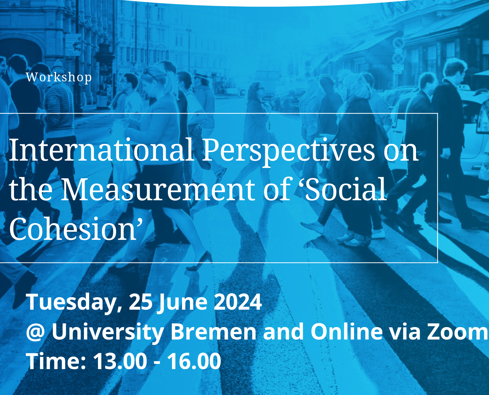
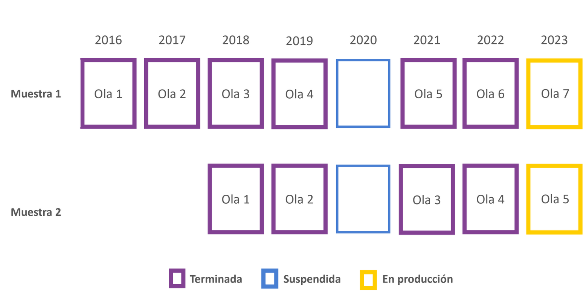
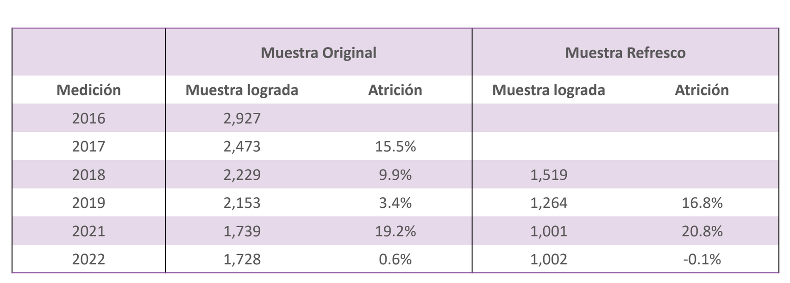

class: hide-logo title

```{r xaringanExtra, echo = FALSE}
  xaringanExtra::use_progress_bar(color = "red", location = c("top"))
```

.pull-left-narrow[



<br>
<br>


]

.pull-right-wide[
.content-box-blue[
.right[
# .dark-blue[Measuring Social Cohesion in Chile with Longitudinal Survey Data]

----

### .black[Prof. Juan Carlos Castillo]

.small[
<div style="line-height:150%;">
Department of Sociology, Universidad de Chile
[juancastillov@uchile.cl](juancastillov@uchile.cl) - [jc-castillo.com](https://jc-castillo.com)]
</div>
.small[
<br>


]   
]
]
]


???

---
background-color: #1e236b

.pull-left-narrow[
<br>

# **.red[Topics]**
]

.pull-right-wide[

<br>


## .white[1- Context: COES]

## .white[2- ELSOC Panel survey]

## .white[3- Social cohesion & ELSOC]

## .white[4- Measurement & results]


]

---
background-color: #1e236b

.pull-left-narrow[
<br>

# **.red[Topics]**
]

.pull-right-wide[

<br>


## **.yellow[1- Context: COES]**

## .grey[2- ELSOC Panel survey]

## .grey[3- Social cohesion & ELSOC]

## .grey[4- Measurement & results]


]


---
class: middle

.pull-left-narrow[


]

.pull-right-wide[
- Started in 2013, competitive research grant for excellence centers

- Consortium of four universities

- Interdisciplinary  (economy, social pychology, sociology, urban studies,  geography)

- About 100 members (associate researchers, adjunct researchers, postdocs, research assistants)

  ]


---


---
class: middle center


---
class: middle center

---
class: inverse middle center

.white[## More information:]

#[.yellow[coes.cl]](https://coes.cl/)

---
background-color: #1e236b

.pull-left-narrow[
<br>

# **.red[Topics]**
]

.pull-right-wide[

<br>


## .grey[1- Context: COES]

## **.yellow[2- ELSOC Panel survey]**

## .grey[3- Social cohesion & ELSOC]

## .grey[4- Measurement & results]
]


---
class: middle center


[ https://coes.cl/encuesta-panel/  ](https://coes.cl/encuesta-panel/)

---
# Technical data sheet

.left-column[
### Design
]

.right-column[

- Face-to-face survey with structured questionnaire 

- Combines modules of permanent questions (measured in all the waves) and questions interspersed between waves

]

---
# Technical data sheet

.left-column[
### Design

### Longitudinal design
]

.right-column[

- Annual repeated panel 

- A similar questionnaire is applied to two independent samples 

- The second (refreshment) sample was implemented from the third year of measurement (2018)

]


---



.small[Wave of 2021 transitioned from a face-to-face modality (CAPI) to a telephone modality (CATI)]

---
# Technical data sheet

.left-column[
### Design

### Longitudinal design

### Target Population
]

.right-column[

- Men and women between 18 and 75 years of age (in wave 1)

- Located in 40 cities in urban areas (92 communes, 13 regions) of the country.

]

---
# Technical data sheet

.left-column[
### Design

### Longitudinal design

### Target Population

### Sampling Design
]

.right-column[

- Probabilistic, stratified (by the size of cities), clustered, and multistage. 

- The sample -in its first measurement- is representative of the urban population living in cities with 10,000 or more inhabitants. This is equivalent to approximately 77% of the country's total population and 93% of the urban population.


]


---
# Attrition


---
# Thematic coverage

.pull-left[
1- Citizenship and Democracy

2- Social Networks and Intergroup Interactions

3- Legitimacy and social inequality

4- Social conflict
]

.pull-right[

5- Neighborhood and territorial dimension

6- Health and well-being

7- Socio-demographic characterization
]


---

background-color: #1e236b

.pull-left-narrow[
<br>

# **.red[Topics]**
]

.pull-right-wide[

<br>


## .grey[1- Context: COES]

## .grey[2- ELSOC Panel survey]

## **.yellow[3- Social cohesion & ELSOC]**

## .grey[4- Measurement & results]
]


---
# What is social cohesion?

.center[
.red[Social cohesion]: _‘a quasi-concept, that is, one of those hybrid mental constructions that politics proposes to us more and more often in order to simultaneously detect possible consensuses on a reading of reality, and to forge them’’_ (p. 2).
]
<br>

.medium[Bernard, P. (1999). Social cohesion: A critique. Canadian Policy Research Networks.]

---

.pull-left-narrow[
# Conceptual keys (1)
]
.pull-right-wide[
.content-box-red[
.right[
_"We believe that a good definition of social cohesion, just like any other concepts in the social sciences, should be judged in terms of two criteria: (1) .red[minimal] in scope and (2) close to .red[ordinary usage_]" (p.280).
]
]
<br>
.right[
.small[Chan, J., To, H.-P., & Chan, E. (2006). Reconsidering Social Cohesion: Developing a Definition and Analytical Framework for Empirical Research. _Social Indicators Research_, 75(2), 273–302.
]
]
]
---
.pull-left-narrow[
# Conceptual keys (2)
]
<br>

.pull-right-wide[
.content-box-purple[
.right[
"_Social cohesion is a state of affairs concerning both the **.red[vertical]** and the **.red[horizontal]** interactions among members of society as characterized by a set of attitudes and norms that includes .red[trust], a sense of .red[belonging] and the willingness to .red[participate and help], as well as their behavioural manifestations_". (p. 290)
]
]

.right[
.small[Chan, J., To, H.-P., & Chan, E. (2006). Reconsidering Social Cohesion: Developing a Definition and Analytical Framework for Empirical Research. _Social Indicators Research_, 75(2), 273–302.
]
]
]

---
## Some international social cohesion survey projects

* Mapping Social cohesion (Canada 1998)

* Scanlon-Monash Index of Social Cohesion (Australia 2007-2019)

* Social cohesion radar (Germany-International)

* Civic engagement and Social cohesion report (USA 2014)

* ECOsociAL (seven Latin American countries 2007)

* (FGZ Social Cohesion Panel 2021 ->)


???
Each of these studies has proposed different definitions of social cohesion, accompanied by different forms of operationalization. As a result, there are different dimensions, sub-dimensions and indicators that seek to measure social cohesion across these projects. Some of these dimensions are common among studies, but most of them present wide differences in their operationalization, combining indicators that in some studies are presented as sub-dimensions and in others constitute differentiated dimensions. As a result of conceptual differences, the nesting structure of dimensions and sub-dimensions is different between projects, which makes it difficult to make a direct comparison between the experiences reviewed. 

---
## Measuring social cohesion in international projects
----

.pull-left[
.content-box-red[
### Inconsistencies

- conceptual

- dimensions / subdimensions
]
]

.pull-left[
.content-box-yellow[
### Communalities

- multidimensional approach

- repeated concepts


]
]

---
## Communalities / intersections
.pull-left[


]

.pull-right[

- Trust in institutions/democracy

- Political participation

- Justice perceptions

- Sense of belonging

- Neighbourhood life quality
- Social networks
]

???
The common dimensions accross projects are the following, and based on these communalities our objective was to organize them into the more general framework from Chan, To and Chan (vertical/horizontal), creating a new framework for defining and measuring social cohesion

---
class: center middle


???

And we are in this situation, trying to make a standard based on the communalities of previous standards, and so generating another one. 


---
class: middle center

.center[]
---
class: middle center

.center[]

---

background-color: #1e236b

.pull-left-narrow[
<br>

# **.red[Topics]**
]

.pull-right-wide[

<br>


## .grey[1- Context: COES]

## .grey[2- ELSOC Panel survey]

## .grey[3- Social cohesion & ELSOC]

## **.yellow[4- Measurement & results]**
]


---
.pull-left-narrow[
# Vertical dimension]
.pull-right-wide[

]


---
.pull-left-narrow[
# Horizontal dimension]
.pull-right-wide[

]


---


---


---


---
class: inverse

.pull-left-narrow[
### .yellow[Further research]
]
<br>
.pull-right-wide[

- Invariance testing

- SES and social cohesion

- Relationship between vertical and horizontal dimensions

- Contextual variables

- Longitudinal models
]
---
class: center middle

# Further information:
----

.pull-left[


###Observatory of Social Cohesion
[ocs-coes.netlify.app](https://ocs-coes.netlify.app/)

]

.pull-right[

### Github repo
[github.com/ocscoes](https://github.com/ocscoes/medicion-cohesion-elsoc)
]


---
class: center middle

# Thanks for your attention!

Contact info:

Juan Carlos Castillo / juancastillov@uchile.cl - [jc-castillo.com](https://juancarloscastillo.github.io/jc-castillo/)

Department of Sociology - Universidad de Chile

.center[]

---
class: hide-logo title

.pull-left-narrow[


<br>
<br>


]

.pull-right-wide[
.content-box-blue[
.right[
# .dark-blue[Measuring Social Cohesion in Chile with Longitudinal Survey Data]

----

### .black[Prof. Juan Carlos Castillo]

.small[
<div style="line-height:150%;">
Department of Sociology, Universidad de Chile
[juancastillov@uchile.cl](juancastillov@uchile.cl) - [jc-castillo.com](https://jc-castillo.com)]
</div>
.small[
<br>


]   
]
]
]


