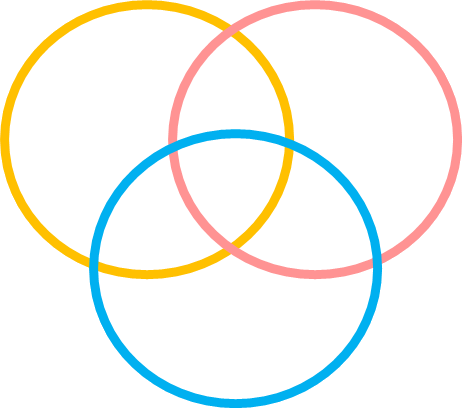
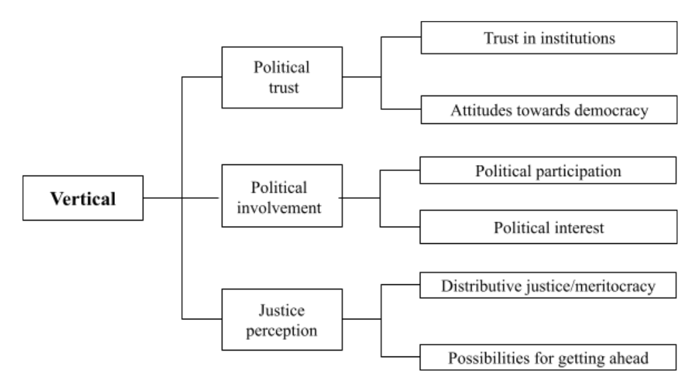
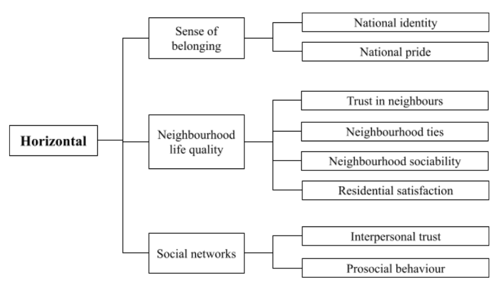
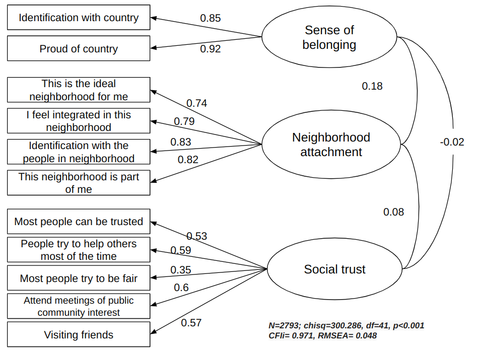
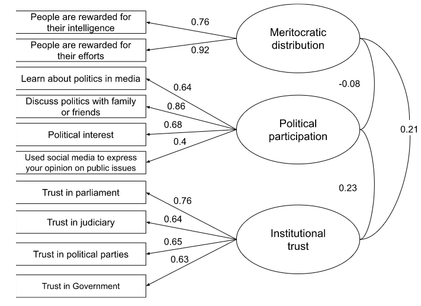

class: hide-logo title

```{r xaringanExtra, echo = FALSE}
  xaringanExtra::use_progress_bar(color = "red", location = c("top"))
```

.pull-left-narrow[


.tiny[
[bit.ly/cohesion-indicators](https://bit.ly/cohesion-indicators)
]
]

.pull-right-wide[
.content-box-red[
.right[
# Concepts, Measurement and Indicators of Social Cohesion

## A Longitudinal Perspective
----

.medium[
<div style="line-height:150%;">
Juan Carlos Castillo*
<br> Ignacio Cáceres <br>
Kevin Carrasco
</div>
.small[
 *Department of Sociology, Universidad de Chile
 mail:[juancastillov@uchile.cl](juancastillov@uchile.cl) - [jc-castillo.com](https://jc-castillo.com)]   
]

]
]

]

???

---
background-color: black

.pull-left-narrow[
# .orange[**Contents**]
]

.pull-right-wide[

<br>


## .white[1- What is social cohesion?]

## .white[2- Operationalization in survey research]

## .white[3- Conceptual proposal ]

## .white[4- Implementation in Chilean panel survey
]
]

---
background-color: black

.pull-left-narrow[
# .orange[**Contents**]
]


.pull-right-wide[

<br>

## .red[1- What is social cohesion?]


## .gray[2- Operationalization in survey research]

## .gray[3- Conceptual proposal ]

## .gray[4- Implementation in Chilean panel survey
]
]


---
# What is social cohesion?

.center[
.red[Social cohesion]: _‘a quasi-concept, that is, one of those hybrid mental constructions that politics proposes to us more and more often in order to simultaneously detect possible consensuses on a reading of reality, and to forge them’’_ (p. 2).
]
<br>

.medium[Bernard, P. (1999). Social cohesion: A critique. Canadian Policy Research Networks.]

---
# Conceptual keys (1)

.center[
_"We believe that a good definition of social cohesion, just like any other concepts in the social sciences, should be judged in terms of two criteria: (1) .red[minimal] in scope and (2) close to .red[ordinary usage_]" (p.280).
]

<br>
.medium[Chan, J., To, H.-P., & Chan, E. (2006). Reconsidering Social Cohesion: Developing a Definition and Analytical Framework for Empirical Research. _Social Indicators Research_, 75(2), 273–302.
]

---
# Conceptual keys (2)

<br>

.center[
"_Social cohesion is a state of affairs concerning both the **vertical** and the **horizontal** interactions among members of society as characterized by a set of attitudes and norms that includes .red[trust], a sense of .red[belonging] and the willingness to .red[participate and help], as well as their behavioural manifestations_". (p. 290)
]
<br>

.medium[Chan, J., To, H.-P., & Chan, E. (2006). Reconsidering Social Cohesion: Developing a Definition and Analytical Framework for Empirical Research. _Social Indicators Research_, 75(2), 273–302.
]

---
background-color: black

.pull-left-narrow[
# .orange[**Contents**]
]

.pull-right-wide[

<br>


## .gray[1- What is social cohesion?]

## .red[2- Operationalization in survey research]

## .gray[3- Conceptual proposal ]

## .gray[4- Implementation in Chilean panel survey
]
]


---
# International social cohesion survey projects

* Mapping Social cohesion (Canada 1998)

* Scanlon-Monash Index of Social Cohesion (Australia 2007-2019)

* Social cohesion radar (Germany-International)

* Civic engagement and Social cohesion report (USA 2014)

* ECOsociAL (seven Latin American countries 2007)

???
Each of these studies has proposed different definitions of social cohesion, accompanied by different forms of operationalization. As a result, there are different dimensions, sub-dimensions and indicators that seek to measure social cohesion across these projects. Some of these dimensions are common among studies, but most of them present wide differences in their operationalization, combining indicators that in some studies are presented as sub-dimensions and in others constitute differentiated dimensions. As a result of conceptual differences, the nesting structure of dimensions and sub-dimensions is different between projects, which makes it difficult to make a direct comparison between the experiences reviewed. 


---
# Communalities / intersections
.pull-left[



]

.pull-right[

- Trust in institutions/democracy

- Political participation

- Justice perceptions

- Sense of belonging

- Neighbourhood life quality
- Social networks
]

---
background-color: black

.pull-left-narrow[
# .orange[**Contents**]
]


.pull-right-wide[

<br>

## .gray[1- What is social cohesion?]


## .gray[2- Operationalization in survey research]

## .red[3- Conceptual proposal ]

## .gray[4- Implementation in Chilean panel survey
]
]

---
class: middle center

.center[]
---
class: middle center

.center[]

---
background-color: black

.pull-left-narrow[
# .orange[**Contents**]
]


.pull-right-wide[

<br>

## .gray[1- What is social cohesion?]


## .gray[2- Operationalization in survey research]

## .gray[3- Conceptual proposal ]

## .red[4- Implementation in Chilean panel survey
]
]

---
# Data: ELSOC Panel Survey 2016-2023

- Chilean annual representative face-to-face survey, adults from 18 years old in urban areas of more than 10.000 inhabitants

- 6 waves so far

- N =3.000 (1st wave)

- Average attrition 15%

- Further information: [coes.cl/encuesta-panel](https://coes.cl/encuesta-panel/)

---
.pull-left-narrow[
# Horizontal dimension]
.pull-right-wide[

]

---
.pull-left-narrow[
# Vertical dimension]
.pull-right-wide[

]


---


---


---


---
class: inverse

.pull-left-narrow[
## .yellow[Future agendas]
]
<br>
.pull-right-wide[
- SES and social cohesion

- Relationship between vertical and horizontal dimensions

- Contextual variables

- Comparative research
]
---


# Further information:

###[- coes.cl](https://coes.cl/)

###[- ocs-coes.netlify.app](https://ocs-coes.netlify.app/)

### [- github.com/ocscoes/medicion-cohesion-elsoc](https://github.com/ocscoes/medicion-cohesion-elsoc)


---
class: center middle

# Thanks for your attention!

Contact info:

Juan Carlos Castillo / juancastillov@uchile.cl - [jc-castillo.com](https://juancarloscastillo.github.io/jc-castillo/)

Department of Sociology - Universidad de Chile

.center[]
