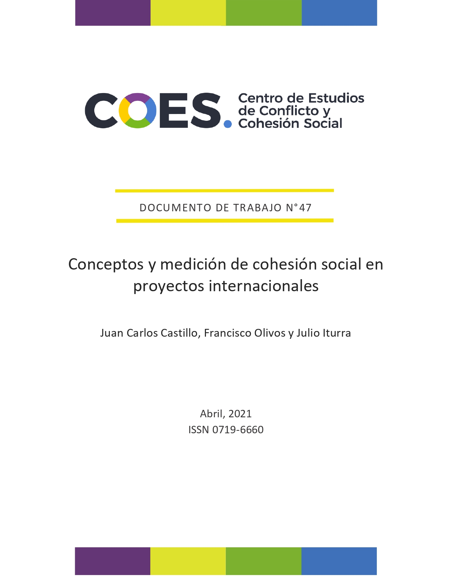
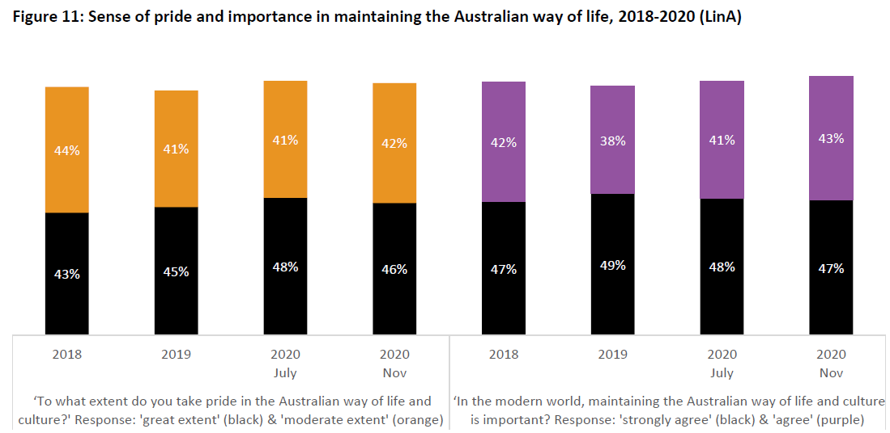
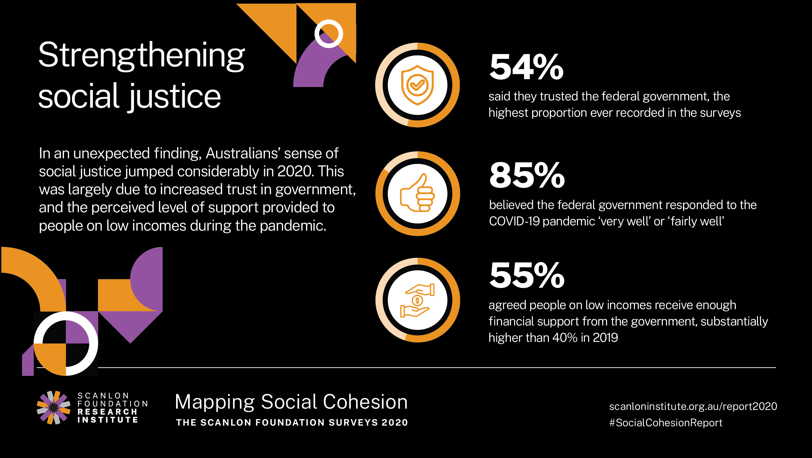
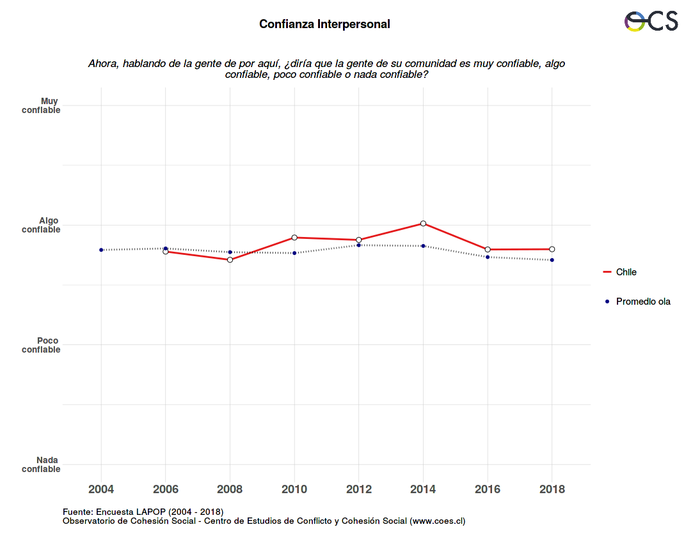

class: middle hide-logo title

.center[]
.center[
### Informe medición de cohesión social a partir de datos ELSOC - 30 Abril 2021 
]

---
class: roja upper right
# Estructura de la presentación

1- Objetivos

2- Proyecciones

3- Dimensiones utilizadas en estudios internacionales

4- Propuesta conceptual con ELSOC

---
class: roja bottom right

# Objetivos

---
class: inverse center

# Objetivos

El .red[objetivo] de este informe es identificar los principales indicadores presentes en el **Estudio longitudinal Social de Chile (ELSOC)** que permiten .red[operacionalizar y medir] el concepto de .red[cohesión social]. 

--

Estos indicadores son seleccionados a partir de una revisión sistemática de distintas propuestas y experiencias de .red[estudios internacionales], presentes en el documento de trabajo **Conceptos y medición de cohesión social en proyectos internacionales**

---

.center[]

---
class: roja bottom right

# Proyecciones

---
# Proyecciones
* [Mapping Social cohesion](https://www.monash.edu/__data/assets/pdf_file/0005/2473583/mapping-social-cohesion-national-report-2020.pdf) de .red[THE SCANLON FOUNDATION SURVEYS] 

--

.center[]

---
# Proyecciones
* [Mapping Social cohesion](https://www.monash.edu/__data/assets/pdf_file/0005/2473583/mapping-social-cohesion-national-report-2020.pdf) de .red[THE SCANLON FOUNDATION SURVEYS] 

.center[]

---
class: roja bottom right

# Dimensiones utilizadas en estudios internacionales

---
# Estudios internacionales

--
* Mapping Social cohesion

--
* Scanlon-Monash Index of Social Cohesion

--
* Social cohesion radar

--
* Civic engagement and Social cohesion report

--
* ECOsociAL

--
* Consejo asesor de Cohesión social

---
# Dimensiones

.pull-left[
* Sentido de pertenencia
* Confianza en instituciones
* Percepción de justicia
* Participación política
* Foco en el bien común
* Confianza social
* Aceptación de la diversidad
* Redes sociales
]

.pull-right[
* Trato digno
* Satisfacción con la vida, felicidad y expectativas sobre el futuro
* Calidad de la convivencia social
* Percepción de oportunidades y movilidad social
]

---
## Ejemplos de medición
.small[* Sentido de pertenencia:]
  .small[- En Scanlon-Monash Index of Social Cohesion la dimensión sentimiento de pertenencia incluye subdimensiones de sentimiento de orgullo por el país y la importancia de mantener la cultura de Australia.]
  .small[- En ECOsociAL una subdimensión denominada Adhesión a la nación incluye indicadores sobre el sentimiento de orgullo hacia el país y si se deberían priorizar la economía y la cultura del país.]
  .small[- En el consejo asesor de Cohesión social la dimensión sentimiento de pertenencia incluye subdimensiones de identificación, confianza en instituciones y percepción de justicia.]
---
## Ejemplos de medición
.small[* Participación política:]
  .small[- En Mapping Social Cohesion la subdimensión de Partición y solidaridad incluye indicadores sobre participación electoral, participación en asociaciones voluntarias y frecuencia en que se realizan donaciones]
  .small[- En Scanlon-Monash Index of Social Cohesion la dimensión de participación política incluye indicadores sobre participación en elecciones y en manifestaciones.]
  .small[- En el consejo de cohesión social la subdimensión de participación cívica posee indicadores sobre participación electoral, interés en la política y trabajo en organizaciones sociales.]
---
class: roja bottom right

# Propuesta conceptual con ELSOC

---
# Indicadores ELSOC

.center[]
---
# Indicadores ELSOC

.center[]

---
# [Observatorio de Cohesion Social](https://ocs-coes.netlify.app/) de .red[COES]
--
.center[]

---
class:middle hide-logo title

.center[]