class: middle hide-logo title

```{r xaringanExtra, echo = FALSE}
  xaringanExtra::use_progress_bar(color = "red", location = c("top"))
```

.pull-left-narrow[
.espaciosimple[
.tiny[2nd Yearly Seminar Research Cluster 2 - Research Institute Social Cohesion]
]
<br>
<br>
<br>
<br>
<br>
<br>
<br>


]


.pull-right-wide[
.right[

.content-box-red[
# Measurement and Analysis of Social Cohesion
]


.medium[.red[### Perspectives from the Center of Social Conflict and Cohesion Studies]]

----
.espaciosimplelineas[
.medium[
.blue[Juan C. Castillo] - Universidad de Chile 

.blue[Matías Bargsted] - P. Universidad Católica de Chile

] 
]


<br>


.small[January 21, 2022 - Bremen (online)]

]
]
???

First of all, a few words about the research center in which this paper is framed.

The Center of Social Conflict and Cohesion Studies was born in 2013 funded by a grant of our national research agency ANID. We have four research lines covering socieconomic, interactional, political and territorial aspects of social conflict and cohesion. Currently there are about 50 researchers involved, who are academics from four of the largest universities in Chile.

Part of our efforts have been related with the conceptualization and measurement of social cohesion, and the present paper is part of this enterprise.

---
class: inverse middle center

# Some context

---

.pull-left-narrow[
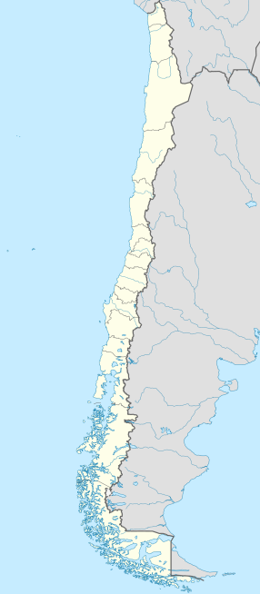
]

.pull-right-wide[
## Chile: Quick context

- Population: 19 million (almost half in the capital, Santiago)

- Military dictatorship from 1973-1990, deep neoliberal reforms 

- Growing migration in the last 10 years

- Democratic disaffection, low voting turnout

- Low poverty and high inequality 

]

---
class: middle center
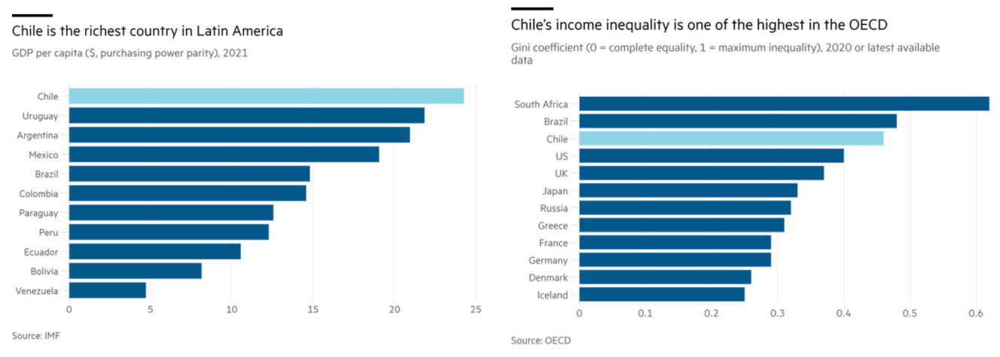


---
class: inverse middle


# 1. About COES

# 2. ELSOC panel survey

---
class: inverse middle


# 1. .red[About COES]

# 2. ELSOC panel survey


---
class: middle

.pull-left-narrow[


]

.pull-right-wide[
- Started in 2013, competitive research grant for excellence centers

- Consortium of four universities

- Interdisciplinary  (economy, social pychology, sociology, urban studies,  geography)

- About 100 members (associate researchers, adjunct researchers, postdocs, research assistants)

  ]


---

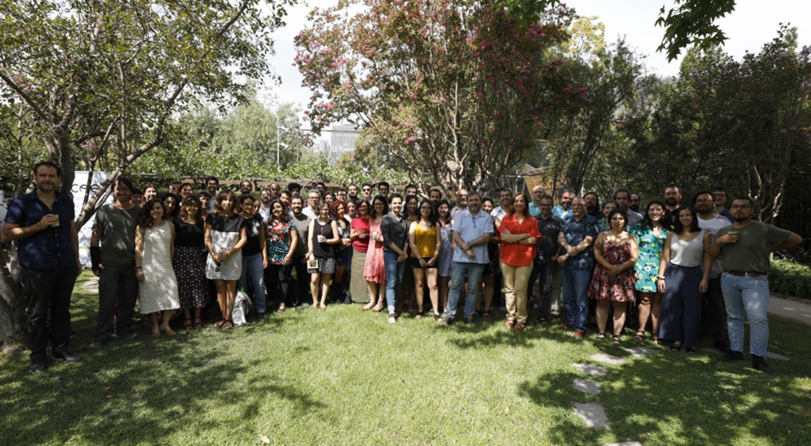

---
class: middle center

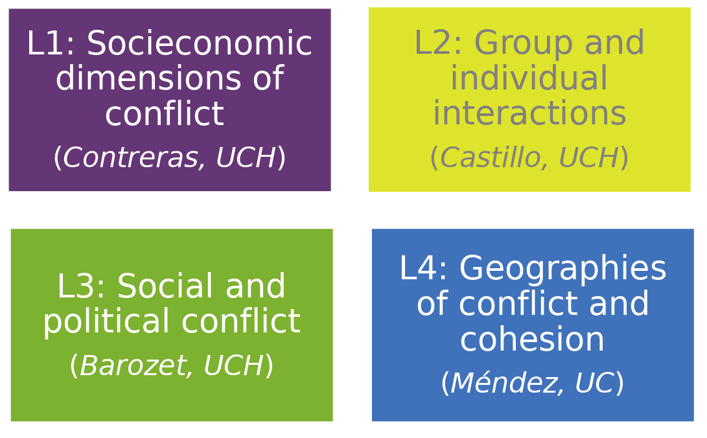
---
class: middle

.pull-left-narrow[
<br>
<br>
<br>
<br>
# Transversal agendas
]

.pull-right-wide[
.right[
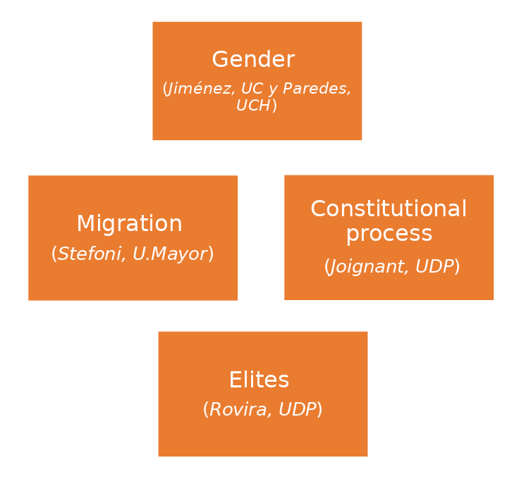]
]

---
class: middle center inverse
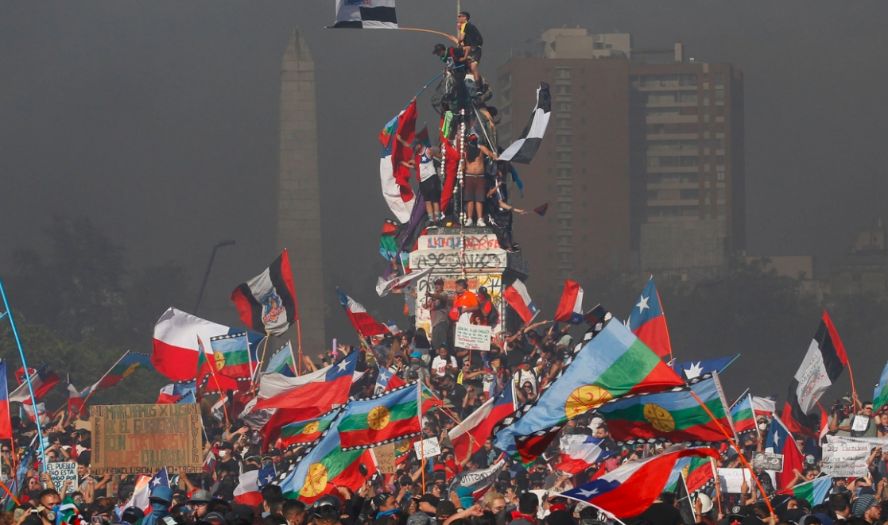

.right[.tiny[October 2019]]

---
class: middle center
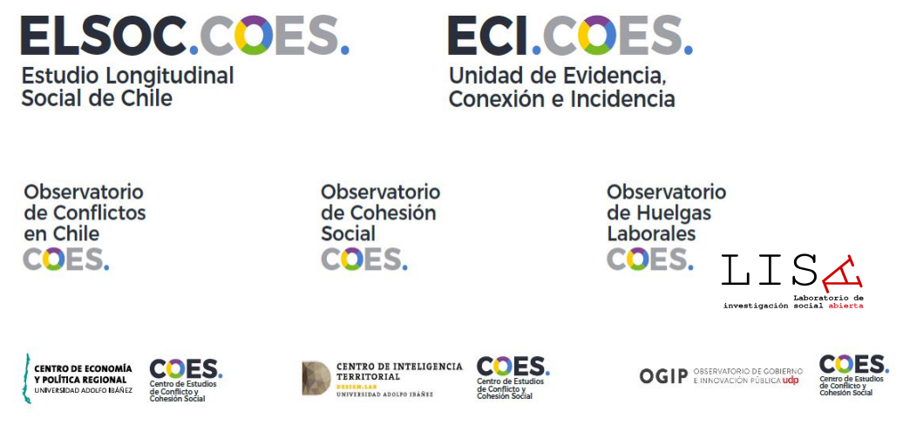
---
class: roja middle center

.white[## More information:]

#[.yellow[coes.cl]](https://coes.cl/)


---
class: inverse middle


# 1. About COES

# 2. .red[ELSOC panel survey]

---
class: middle center


[ https://coes.cl/encuesta-panel/  ](https://coes.cl/encuesta-panel/)


---
# Technical data sheet

.left-column[
### Design
]

.right-column[

Face-to-face survey with structured questionnaire. Combines modules of permanent questions (measured in all the waves) and other questions interspersed between waves

]

---
# Technical data sheet

.left-column[
### Design

### Longitudinal design
]

.right-column[

Annual repeated panel (a similar questionnaire is applied to two independent samples). The second sample was implemented from the third year of measurement (2018)

]

---
# Technical data sheet

.left-column[
### Design

### Longitudinal design

### Target Population
]

.right-column[

Men and women between 18 and 75 years of age (in wave 1), usual residents of occupied private dwellings in urban areas, located in 40 cities in urban areas, located in 40 cities (92 communes, 13 regions) of the country.

]

---
# Technical data sheet

.left-column[
### Design

### Longitudinal design

### Target Population

### Sampling Design
]

.right-column[

Probabilistic, stratified (by the size of cities), clustered, and multistage. 
Representativeness: The sample -in its first measurement- is representative of the urban population living in cities with 10,000 or more inhabitants. This is equivalent to approximately 77% of the country's total population and 93% of the urban population.


]

---
# Longitudinal design

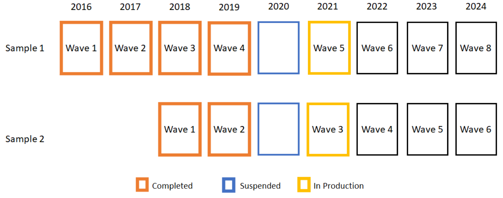

.small[Wave of 2021 transitioned from a face-to-face modality (CAPI) to a telephone modality (CATI)]
---
# Attrition

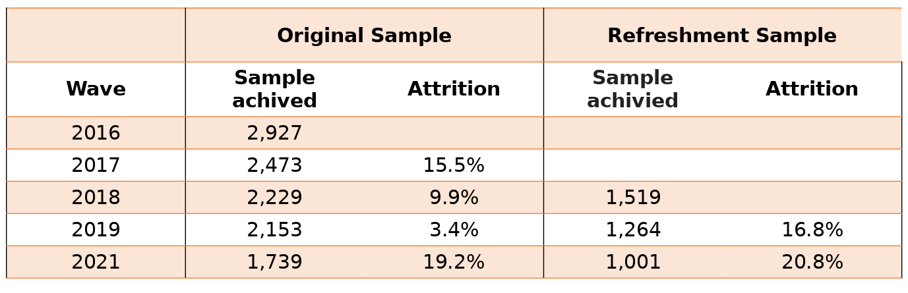
---
# Thematic coverage

.pull-left[
1- Citizenship and Democracy

2- Social Networks and Intergroup Interactions

3- Legitimacy and social inequality

4- Social conflict
]

.pull-right[

5- Neighborhood and territorial dimension

6- Health and well-being

7- Socio-demographic characterization
]

---
# Publications

- 14 papers (WOS-Scopus)

- 1 book chapter

- 6 graduate theses

- 9 research documents

---
# Selected publications
.tiny[
Bargsted, M., Cáceres, I., Ortiz, F. & Somma, N. (2022) Social and Political Trust in a Low Trust Society. Political Behavior, https://doi.org/10.1007/s11109-021-09762-2 

Garreton, M., Espinoza, V., & Cantillan, R. (2021) Social capital in the urban context: Diversity and social contacts in Chilean cities, Journal of Urban Affairs, https://doi.org/10.1080/07352166.2021.1974302 

Chayinska, M., Miranda, D & González, R. (2021). A longitudinal study of the bidirectional causal relationships between online political participation and offline collective action. Computers in Human Behavior. https://doi.org/10.1016/j.chb.2021.106810 

Madero-Cabib, I., & Cabello-Hutt, T. (2021). Complexity in Employment and Coresidential Trajectories Among (Dis)Advantaged Social Groups in Chile. Social Forces, soab084. https://doi.org/10.1093/sf/soab084

Otero, G., Volker, B. & Rozer, J. (2021) Open but segregated? Class divisions and network structure of social capital in Chile. Social Forces, 2021, https://doi.org/10.1093/sf/soab005


Méndez, M. L., Otero, G., Link, F., López Morales, E., & Gayo, M. (2020). Neighbourhood cohesion as a form of privilege. Urban Studies. https://doi.org/10.1177/0042098020914549

Contreras, D., Otero, G., Diaz, J. & Suarez, N. (2019) Inequality in social capital in Chile: Assessing the importance of Social Networks. Social Networks 58 (59-77) https://doi.org/10.1016/j.socnet.2019.02.002.]

---
## Results highlights 1: Left-right preferences

.center[
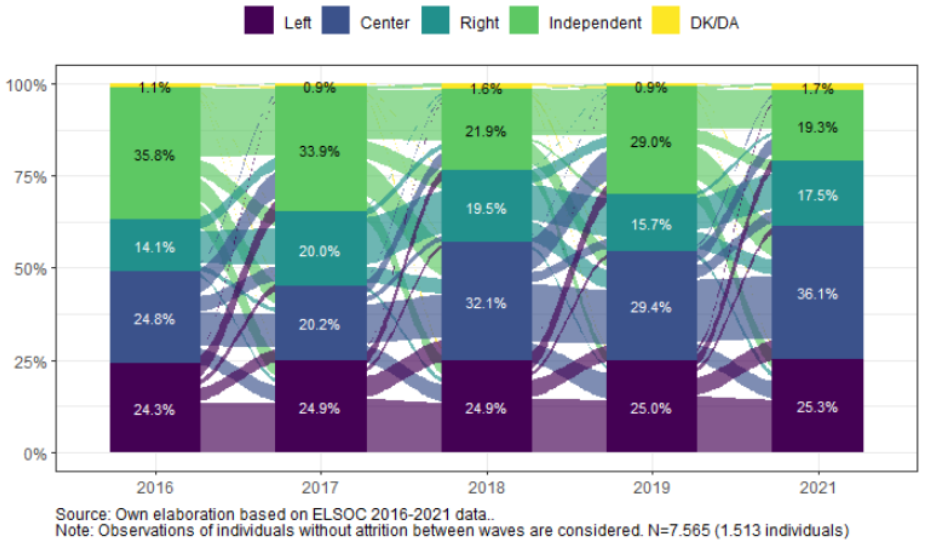
]
---
## Results highlights 2: LCA political participation

.center[
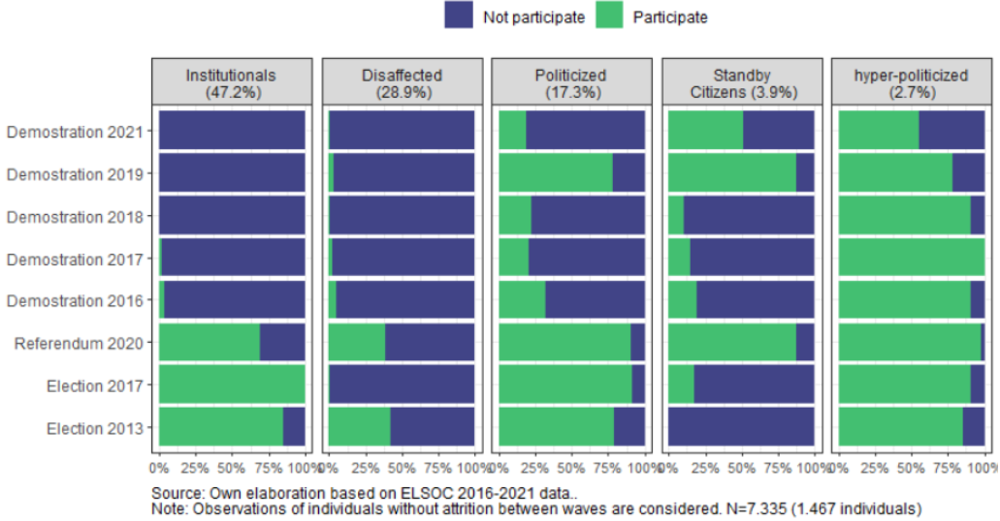
]

---
class: inverse middle center

# Last panel report online:

[https://radiografia-cambio-social-2016-2021.netlify.app/](https://radiografia-cambio-social-2016-2021.netlify.app/)

---
class: center middle

# Thanks for your attention!

Contact info:

.espaciosimplelineas[
 Juan Carlos Castillo -  juancastillov@uchile.cl / [jc-castillo.com](https://jc-castillo.com)

Department of Sociology - Universidad de Chile
]

----
.espaciosimplelineas[
Matías Bargsted  -  mbargsted@uc.cl  

Institute of Sociology / P. Universidad Católica de Chile
]

----
.center[]
