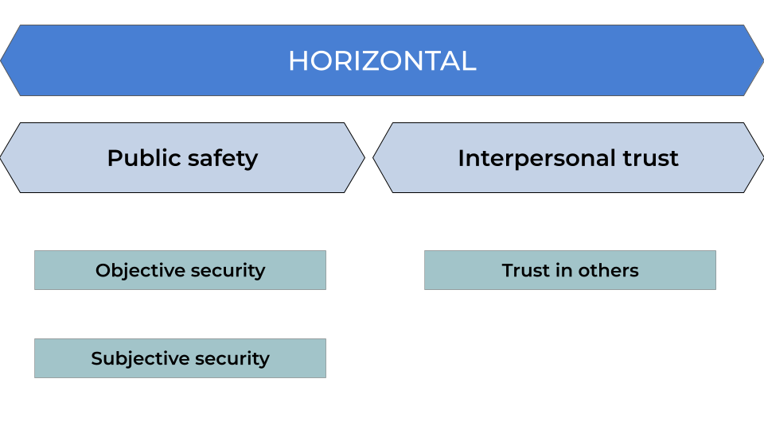
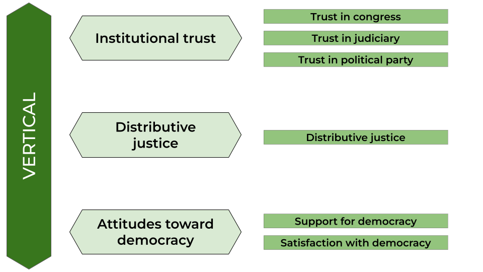

---
format:
  revealjs:
    slide-number: true
    show-slide-number: print
    logo: images/ocs-transparent.png
    theme: [ocs.scss]
    transition: fade            # ← global
    transition-speed: slow
    auto-play-media: false
    view-distance: 100
    mobile-view-distance: 100
    fig-cap-location: top        # ← nombre correcto
    scrollable: false
editor: source
bibliography: input/book-ocs.bib
lang: es
---

# {data-background-color="#ffffff"}

::: columns
::: {.column width="15%"}

:::

::: {.column .column-right width="80%" }

## COES & Observatory of Social Cohesion: {style="text-align: right;"}

### Updates & projections {style="text-align: right;"}

------------------------------------------------------------------------

**Juan Carlos Castillo^1^, Tomás Urzúa^1^, Andreas Laffert^1^ & Julio Iturra^2^**

 

**^1^Department of Sociology, Universidad de Chile**  
**^2^Bremen International Graduate School of Social Sciences** 

 

Universität Bremen

07th April, 2026

:::
::::

# Contents {data-background-color="#2f0202" style="text-align: right;"}

 

- [Updates on  COES & OCS projects]{style="color: #fff;"}
- [ELSOC Panel Visualization]{style="color: #fff;"}
- [Social Cohesion in Latin America paper]{style="color: #fff;"}
- [Comparative vignette study (Julio Iturra)]{style="color: #fff;"}

# Contents {data-background-color="#2f0202" style="text-align: right;"}

 

- Updates on  COES & OCS projects
- [ELSOC Panel Visualization]{style="color: #7c4848;"}
- [Social Cohesion in Latin America paper]{style="color: #7c4848;"}
- [Comparative vignette study (Julio Iturra)]{style="color: #7c4848;"}

# COES

- End of funding
- Universidad de Chile 2026 funding
- OCS projections 2026
  - improve ELSOC panel visualization
  - submit paper on social cohesion in Latin America
  - comparative vignette study paper

# Latin America Visualizer (VISLATAM)

- based on LAPOP survey data
  - 20+ countries, 2004-2022 (11 waves)
  - democracy, social cohesion, trust, etc.
  - 23 countries
  - more than 400.000 cases

- [link to visualizer VISLATAM](https://ocs-coes.shinyapps.io/visualizador-la/)

## Conceptual & measurement model: horizontal 

## Conceptual & measurement model: vertical

# Contents {data-background-color="#2f0202" style="text-align: right;"}

 

- [Updates on  COES & OCS projects]{style="color: #7c4848;"}
- [ELSOC Panel Visualization]{style="color: #fff;"}
- [Social Cohesion in Latin America paper]{style="color: #7c4848;"}
- [Comparative vignette study (Julio Iturra)]{style="color: #7c4848;"}



# Contents {data-background-color="#2f0202" style="text-align: right;"}

 

- [Updates on  COES & OCS projects]{style="color: #7c4848;"}
- [ELSOC Panel Visualization]{style="color: #7c4848;"}
- [Social Cohesion in Latin America paper]{style="color: #fff;"}
- [Comparative vignette study (Julio Iturra)]{style="color: #7c4848;"}



# Contents {data-background-color="#2f0202" style="text-align: right;"}

 

- [Updates on  COES & OCS projects]{style="color: #7c4848;"}
- [ELSOC Panel Visualization]{style="color: #7c4848;"}
- [Social Cohesion in Latin America paper]{style="color: #7c4848;"}
- [Comparative vignette study (Julio Iturra)]{style="color: #fff;"}

# References