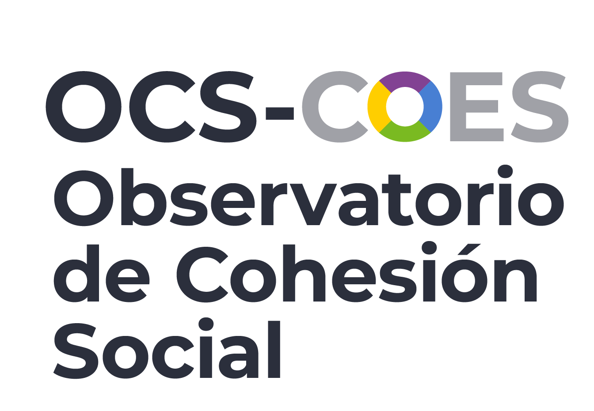
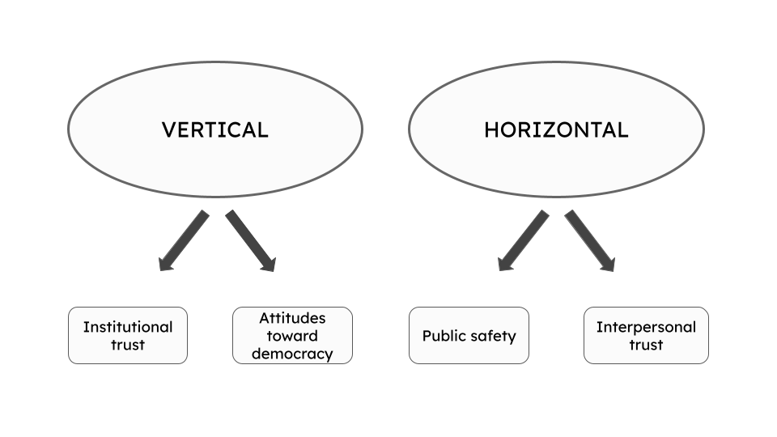
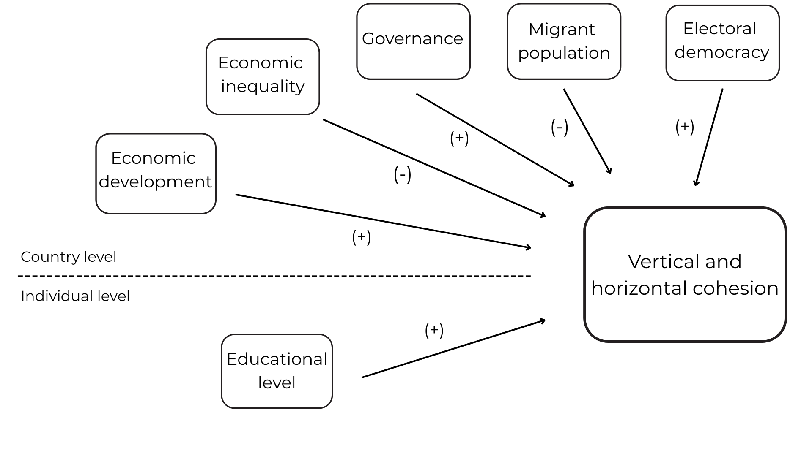
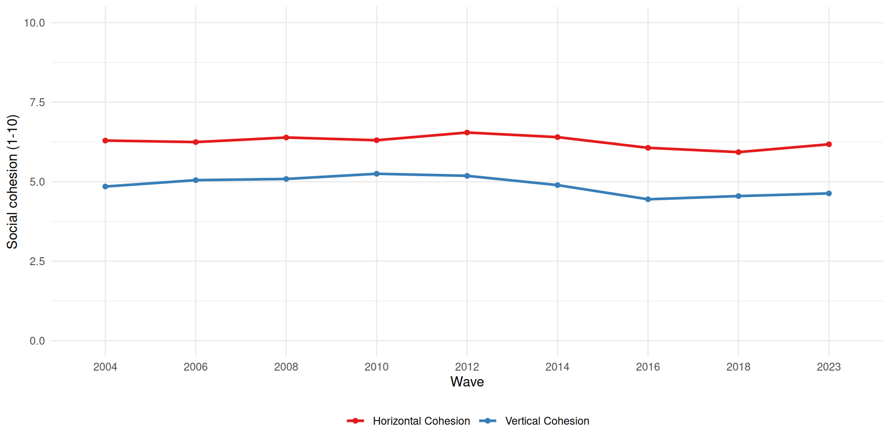
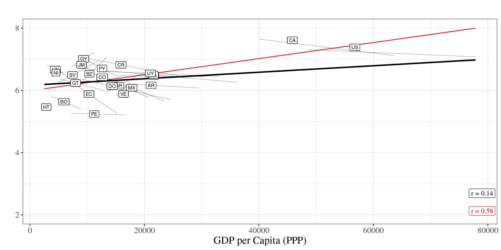
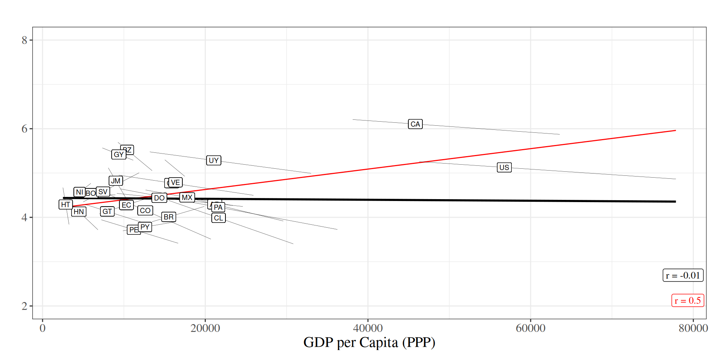
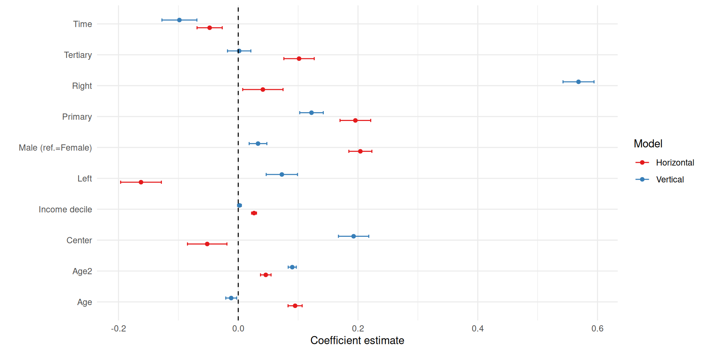
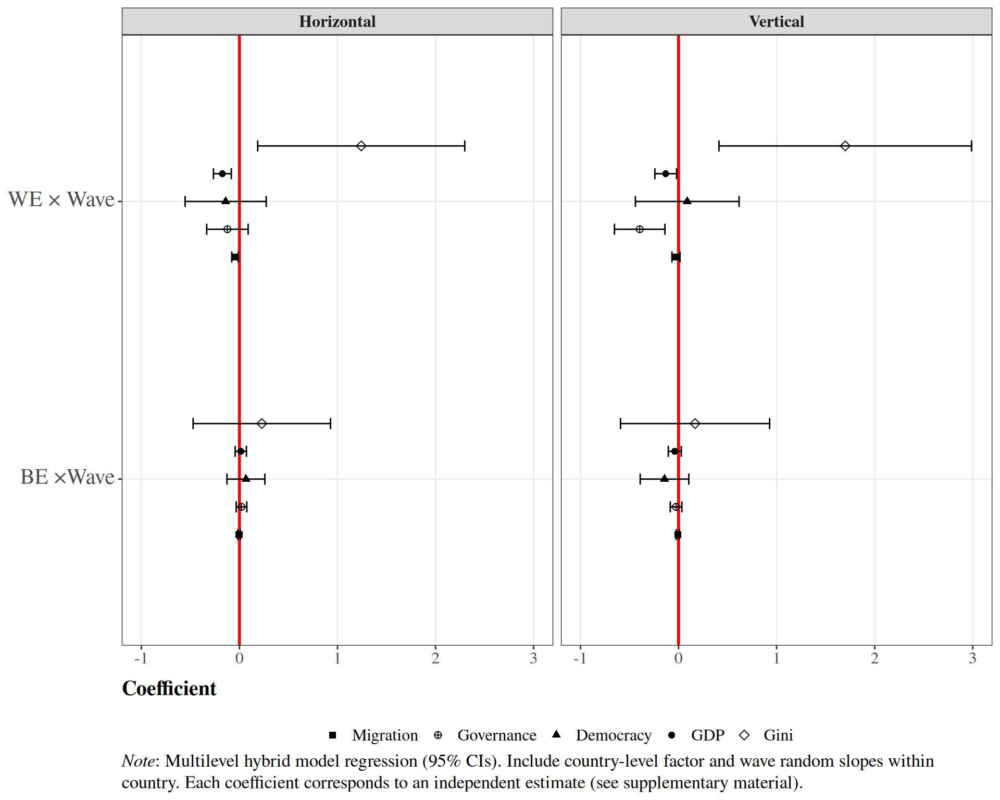

---
format:
  revealjs:
    theme: ocs.scss
    transition: fade
    transition-speed: slow
    slide-number: true
    show-slide-number: print
    fig-cap-location: bottom
editor: source  
---

# {data-background-color="#ffffff"}

::: columns
::: {.column width="15%"}

:::

::: {.column .column-right width="80%" }

## **Two decades of changes in social cohesion in Latin America (2004-2023)** {style="text-align: right;"}

------------------------------------------------------------------------

**Juan Carlos Castillo, Julio Iturra, Gabriel Cortés & Tomás Urzúa**

 

**Department of Sociology, Universidad de Chile**  

 

Universität Bremen

07th April, 2026

:::
::::

# Project context {data-background-color="#1b241f"}

## 

::::: columns
::: {.column width="35%"}

 

{width="100%" fig-align="right"}
:::

:::{.column width="10%"}

:::

::: {.column width="55%" style="font-size: 25px; text-align: center; margin: 0 auto;"}

 

-   
[Social Cohesion Observatory (OCS)](https://ocs-coes.com/){target="_blank"} was a project funded under [Center for the Study of Conflict and Social Cohesion (COES 2013-2025)](https://coes.cl/){target="_blank"}

-   
Launched in 2020 with the aim of contributing to the analysis of social cohesion in Chile and Latin America

-  
It is based on experience gained from international projects focused on conceptualizing and measuring social cohesion

- 
This study: based on data from VISLATAM (N = 179,377, nested within 174 country waves across 25 countries)

:::
:::::

## {data-background-color="#1b241f"}

::: {.highlight-last style="font-size:45px; text-align:center; display:flex; flex-direction:column; justify-content:center; height:80vh; gap:2em;"}

*What have been the regional and national trends over the past two decades in the area of social cohesion in Latin America?*  

*What are the main factors associated with these changes?*

:::

# Theoretical and empirical background {data-background-color="#1b241f"}

##

- 
In Latin America, social cohesion has become increasingly important due to the political instability, persistent inequality, and social conflicts that have characterized recent years [@salazar-xirinachs_repensar_2023].

**Two main approaches:**

:::{.incremental style="font-size: 30px;"}
  
- 
Focus on macro-institutional indicators (UNDP, CEPAL) [@undp_trapped_2023].

- 
Combining individual (micro) variables with macro variables (Ecosocial, OCS).

:::

:::{.notes}
Point One: In recent years, various parts of the world have witnessed social processes reflecting widespread political instability stemming from social conflicts rooted in persistent inequality and corruption. In this context, it has become essential to understand these phenomena within the framework of social ties.

Point two: In the region, both individuals and research centers have focused their efforts on studying social cohesion as a phenomenon in itself, but also as a determinant in social, cultural, and political processes. 

Social cohesion has been studied from an institutional perspective, oriented toward public policy approaches. Here, ECLAC emerges as the leading expert on the subject based on discussions among specialists and authorities, investigating how the implementation of such policies can address social ills related to social bonds

On the other hand, there are studies that have focused on the empirical dimension of social cohesion, attempting to operationalize the concept so that it can be measured. In this context, there is Ecosocial, a study that sought to document the state of social cohesion in seven Latin American countries.  

Along these lines, there is also the Social Cohesion Observatory (which is part of COES), where social cohesion has been studied using various secondary surveys, but which has also developed its own measurement frameworks aimed at understanding social cohesion across its various dimensions. 
:::

## 

### Social cohesion

 

::: {style="font-size: 35px;"}

_“is a state of affairs concerning both the vertical and the horizontal interactions among members of society as characterized by a set of attitudes and norms that includes trust, a sense of belonging and the willingness to participate and help, as well as their behavioural manifestations” (Chan et al., 2006, p. 290)._
:::

 

::: {.highlight-last style="font-size: 25px;"}
Chan, J., To, H.-P., & Chan, E. (2006). Reconsidering Social Cohesion: Developing a Definition and Analytical Framework for Empirical Research. Social Indicators Research, 75(2), 273–302.
:::

##

[Methodological document: Social Cohesion in Latin America](https://ocscoes.github.io/medicion-cohesion-LA/)

## ¿How social cohesion has been studied?

- 
Relevant studies on social cohesion at the international level: Social Cohesion Radar, Ecosocial, VISLATAM.

:::{.incremental style="font-size: 35px;"}
- 
These studies have helped to develop various frameworks for social cohesion, enabling comparative studies across countries.

:::

## Associated factors 

Individual factors:

- Educational level

:::{.incremental style="font-size: 30px;"}

Macrostructural factors: 

- Economic development
- Governance
- Economic inequality
- Migrant population

:::

[@somma_paradojas_2015; @janmaat_social_2010; @delhey_social_2018; @delhey_social_2023; @castillo_social_2023]

# Hipotheses {data-background-color="#1b241f"}

##

:::{.notes}
$H_{1}$: Individuals with higher levels of education will exhibit higher levels of social cohesion

$H_{2}$: Countries with higher levels of inequality will exhibit lower levels of social cohesion

$H_{3}$: Countries with higher levels of economic development will exhibit higher levels of social cohesion

$H_{4}$: Countries with higher levels of governance will exhibit higher levels of social cohesion

$H_{5}$: Increases in the proportion of the migrant population in a country will be associated with decreases in levels of social cohesion

Both the absolute value of the hypothesis’s directionality and the change over time (increase/decrease) must be explained
:::

# Methodology {data-background-color="#1b241f"}

## Data

- 
The data comes primarily from the survey conducted by the [Latin American Public Opinion Project.](https://ropercenter.cornell.edu/latin-american-public-opinion-project-lapop) To supplement this, data from Latinobarómetro and the World Values Survey was used.

::: {.incremental style="font-size: 35px;"}

- 
This study includes a sample of N = 179,377 individuals across 174 country waves in 25 countries, covering the period from 2004 to 2023.

:::

## Variables 

- 
Dependent variables: vertical cohesion index and horizontal cohesion index.

::: {.incremental style="font-size: 35px;"}

- 
Individual independent variables: educational level.

- 
Contextual independent variables: GDP per capita, Gini Index, Electoral Democracy Index, Governance Index, Cultural diversity.

:::

:::{.notes}
The measurement framework for Latin America consists of a vertical dimension and a horizontal dimension.

 The vertical dimension considers trust in institutions, measured by the degree of trust in the judiciary, Congress, and political parties. Attitudes toward democracy assess how much someone supports democracy and how satisfied they are with it. Finally, distributive justice is measured by asking how fair the distribution of income in the country is perceived to be.

Horizontal cohesion is measured by public safety, which addresses subjective safety—that is, the perception of safety—and objective safety, measured by whether or not the respondent has been a victim of crime. Additionally, interpersonal trust is understood as the level of trust people have in their neighbors.
:::

## Method

- 
To validate the conceptual model that was developed, a confirmatory factor analysis was conducted.

:::{.incremental style="font-size: 35px;"}

- 
Hybrid multilevel regression models [@schmidt-catran_random_2016].

  
- 
$y_{jti} = \beta_{0}(t) + \beta_{1}X_{jti} + \gamma_{be}\bar{Z}_{j} + \gamma_{we}(Z_{jt}-\bar{Z}_{j}) + v_j + u_{jt} + e_{jti}$

:::

# Results {data-background-color="#1b241f"}

##

:::{.notes}
Longitudinal descriptive
:::

##

:::{.notes}
Associations
:::

##

##

:::{.notes}
models level 1
:::

## 

:::{.notes}
Interactions
:::

## Discusions

:::{.notes}
Para cerrar, solo volver a recalcar la relevancia de este estudio, que con sus limitaciones y con lo que falta por hacer ya muestran resultados prometedores. Hay pocos estudios que se enfocan en comprender la cohesión social desde una perspectiva longitudinal y multinivel, menos para América Latina, y creemos que los hallazgos que esta investigación pueda entregar son importante para aportar, desde los datos, a la discusión académica y política de la cohesión social. 
:::

## References