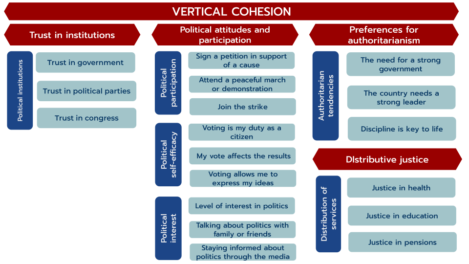

---
format:
  revealjs:
    theme: ocs.scss
    transition: fade
    transition-speed: default
    slide-number: true
    fig-cap-location: bottom
editor: source  
---

# VISELSOC {data-background-color="#212525"}

:::{.notes}

Good morning to everyone, I am Tomás Urzúa, 

last year I was a research assistant at the Social Cohesion Observatory where one of my principles tasks was the development of the Longitudinal Visualizer of Social Cohesion in Chile

:::

## Why VISELSOC?

:::{.incremental .highlight-last}

- We had built already a visualizer for Latin America, but we didn’t have something specifically focused on Chile

- In COES we had a panel survey which is ELSOC and last year we had a special funding since it was the last year of COES, so we decided to apply what we learn from the experience with VISLATAM to ELSOC data

:::

## Data

:::{.incremental .highlight-last}

- We used secondary data from [Chilean Longitudinal Social Study (ELSOC)](https://conferencias.coes.cl/encuesta-panel/)

- It is a panel survey that runs every year from 2016 to 2023, making it the only study of this kind in Chile and Latin America

- For the visualization, the analysis includes participants who took part in at least three waves of the study, totaling 3,666 individuals.

:::

:::{.notes}

We used secondary data from Chilean Longitudinal Social Study, a representative survey of Chile’s urban population that tuns every year from 2016 (two thousand sixteen) to 2023 (two thousand twenty-three), making it a unique source of information of its kind in Chile and Latin America. 

For the creation of the visualizer, only respondents who participated in at least three waves of the study were considered, resulting in a total of three thousand six hundred sixty-six individuals.

:::

## Measurement

:::{.incremental .highlight-last}
- We developed a measurement framework for social cohesion in Chile based on the approach proposed by Chan et al. (2006).

- The framework is based on two dimensions:

  -  Horizontal: addresses the relationships between individuals and social groups

  -  Vertical: captures the interactions between individuals and social institutions
:::

:::{.notes}

The measurement with social cohesion in VISELSOC is quite similar to VISLATAM as both make the distinction between horizontal and vertical dimensions proposed by Chan et al **in** (2006)

But the main difference is that with ELSOC, we have more items for analyzing social cohesion than VISLATAM, and we could **develop** a more comprehensive measurement framework for Chile

:::

## 

:::{.notes}

In the case of **horizontal cohesion**, we can see that there are three subdimensions: public safety, territorial ties, and social networks.

Public safety consists of objective safety —such as the frequency of exposure to violent situations— and subjective safety, which refers to perceptions of safety.

Territorial ties measures people’s sense of belonging to their neighborhood and residents’ satisfaction with their local area.

Social networks are composed of three subdimensions: prosocial behavior, financial assistance, and interpersonal trust.

:::

## 

:::{.notes}

For **vertical cohesion**, we have four subdimensions. First, Trust in institutions, which measures trust in various political institutions such as the government, political parties, and Congress

Second, political attitudes and participation which includes political self-efficacy, political interest and political participation

Then, we have preferences for authoritarianism, which captures the extent to which individuals support authoritarian values and practices.

Finally, we have distributive justice that is composed by how unfair people consider the distribution of healthcare, education, and pensions to be

:::

## Measurement

:::{.incremental .highlight-last}
- We applied a several analytical techniques for to arrive at the final version of the measurement framework.

- Sub-dimensions were calculated as average indices to facilitate the interpretation of the results.

- All the decisions behind the construction of the framework can be found in this [methodological document](https://ocscoes.github.io/propuesta-medicion-elsoc/output/book-cohesion-elsoc/docs/).
:::

:::{.notes}

such as descriptive analyses, correlation matrices, both exploratory and confirmatory factor analysis to verify that the model’s underlying structure was optimal for its application in the Chilean context.

Although we confirmed the factor structure of the data, all sub-dimensions were calculated as average indices to facilitate the interpretation of the results

:::

## Construction

:::{.incremental .highlight-last}

- The visualizer was created entirely by the team at the Observatory of Social Cohesion (OCS).

- It was built using code with Quarto and Shiny App.

- The visualizer’s source code is open access and can be found in our [GitHub repository](https://github.com/ocscoes/OCSVIS-ELSOC)

:::

:::{.notes}

- I don´t know if all of you are familiar with Quarto, but Quarto is an open-source **pəbliSHiNG** system that allows you to create dynamic, reproducible documents, while Shiny App is a Quarto output format that enables the creation of interactive web applications.

:::

# Results [VISELSOC](https://ocs-coes.shinyapps.io/ocs-viselsoc/#)

