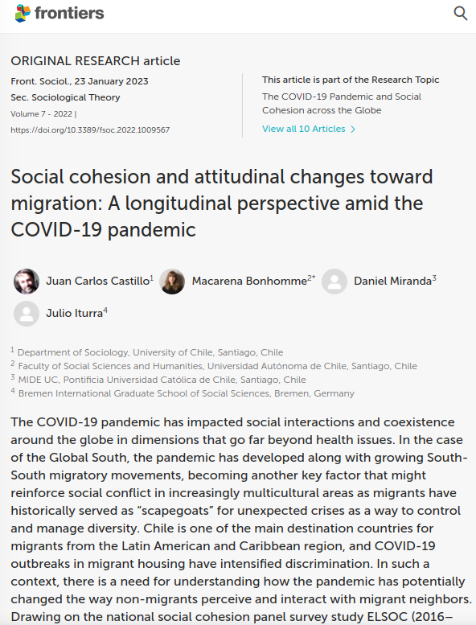
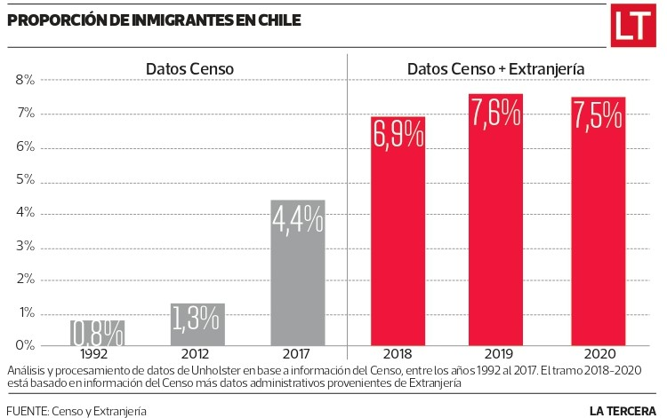
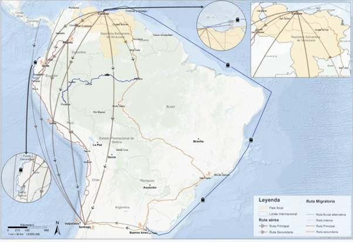
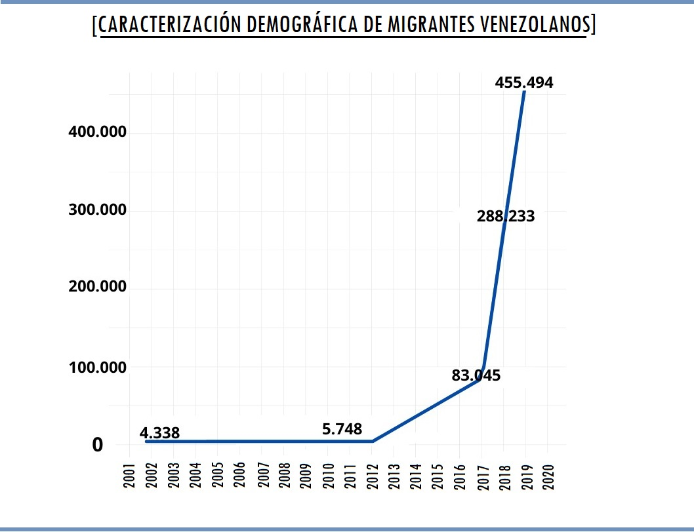
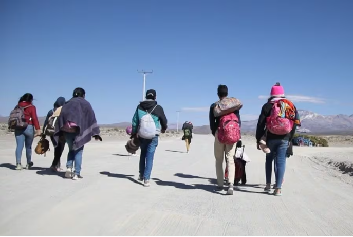
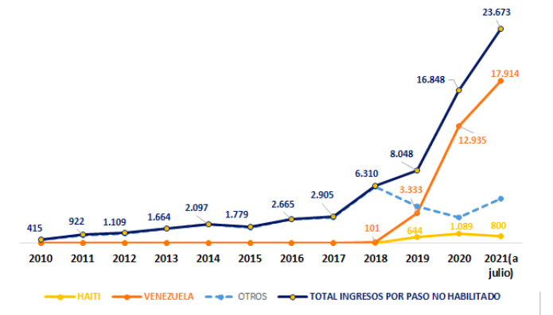
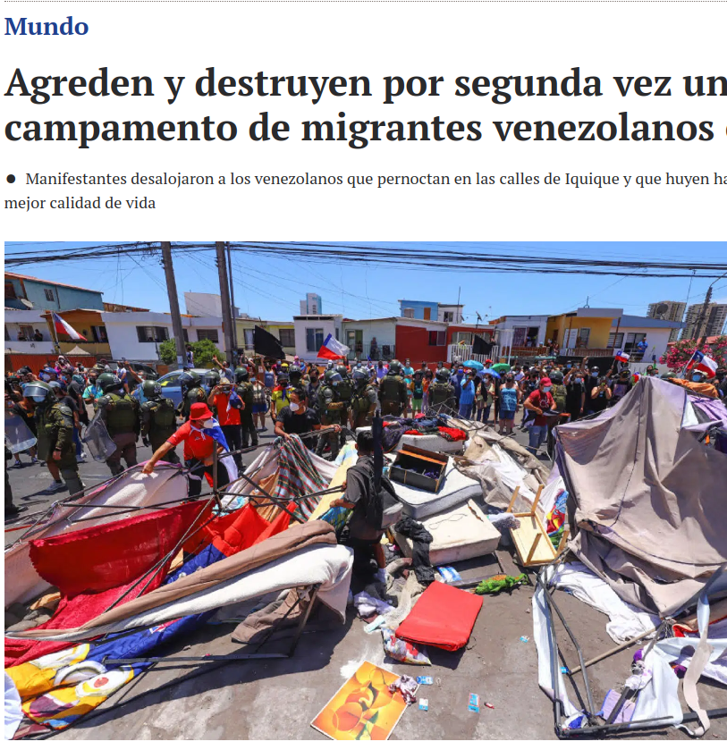

class: middle title-slide

```{r xaringanExtra, echo = FALSE}
  xaringanExtra::use_progress_bar(color = "red", location = c("top"))
```


```{r xaringan-tile-view, echo=FALSE}
xaringanExtra::use_tile_view()
```

.pull-left-narrow[


<br>
<br>
<br>
.red[
<div style="line-height:110%;">
GlobaLab Bremen Conversations on Global Solidarity 
<br> 
</div>
]
<br>
January 17 2024

]

.pull-right-wide[
.right[

.content-box-red[
## Social cohesion and attitudinal changes toward migration:
###A longitudinal perspective amid the COVID-19 pandemic

]

----


.medium[
<div style="line-height:150%;">
Juan Carlos Castillo* 
<br> Macarena Bonhomme, Daniel Miranda & Julio Iturra<br>
</div>
]
<br>
.small[
<div style="line-height:150%;">
*Departmentof Sociology, Universidad de Chile - COES
</div>
[juancastillov@uchile.cl](juancastillov@uchile.cl) - [jc-castillo.com](https://jc-castillo.com)

]
]
]


???
.

---

layout: true
class: animated, fadeIn

---
class: roja bottom right

# Some context

---

.pull-left-narrow[

]

.pull-right-wide[
## Chile: Quick context

- Population: 19 million (almost half in the capital, Santiago)

- Military dictatorship from 1973-1990, deep neoliberal reforms 

- Growing migration in the last 10 years

- Democratic disaffection, low voting turnout

- Low poverty and high inequality 

]

---
class: middle center


---
class: middle center inverse


.right[.medium[October 2019]]


---
class: middle

.pull-left-narrow[


]

.pull-right-wide[
- Started in 2013, competitive research grant for excellence centers

- Consortium of four universities

- Interdisciplinary  (economy, social pychology, sociology, urban studies,  geography)

- About 100 members (associate researchers, adjunct researchers, postdocs, research assistants)

  ]


---
class: middle center


---
class: middle center

---
class: inverse middle center

.white[## More information:]

#[.yellow[coes.cl]](https://coes.cl/)

---
class: roja bottom

.pull-left-wide[


]
# The paper

---
# Context


???
De acuerdo a la OCDE, Chile se convirtió el tercer país que más ha aumentado el porcentaje de residentes permanentes con respecto a su población extranjera a partir de 2018 (ver gráfico).

https://www.ex-ante.cl/informe-de-la-ocde-ubica-a-chile-como-el-tercer-pais-que-mas-ha-aumentado-las-residencias-permanentes-a-migrantes/

En 2019, los países de la OCDE recibieron en promedio ocho nuevos migrantes por cada mil habitantes. En el caso de Chile, fueron aproximadamente 18 por cada mil habitantes.

---


???

https://www.latercera.com/la-tercera-sabado/noticia/proporcion-de-migrantes-en-chile-aumenta-siete-veces-en-los-ultimos-30-anos/HSEH4OOIPZAA3JV33EFR2NV4QM/


---




???
https://www.ciperchile.cl/2021/02/05/a-pie-por-colchane-como-la-politica-de-gobierno-forzo-un-ingreso-desesperado-de-migrantes-a-chile/

---


---
class: middle

.pull-left-narrow[

]

.pull-right-wide[

]

???
https://sjmchile.org/2021/09/06/ingreso-por-paso-no-habilitado-en-2021-llega-a-su-maximo-historico/

---
class: center middle


???
- precarious living conditions
- attacked by locals
---
class: inverse right middle

## How attitudes towards migration have changed in times of pandemic and increasing migration flows in Chile?

---
class: middle

.pull-left-narrow[
# Social cohesion
]

.pull-right-wide[
"A state of affairs concerning both the vertical and the horizontal interactions among members of society as characterized by a set of attitudes and norms that includes trust, a sense of belonging and the willingness to participate and help, as well as their behavioural manifestations". (Chan, To & Chan 2006, p. 290)
]
---
## _Horizontal_ social cohesion

- **Convivial attitudes**: individuals' ability to interact and have a friendly coexistence with those they consider ethnically different from themselves.  It implies that people need to have the capacity to be _at ease_ with the presence of diversity (Valluvan, 2016).

--

- **Identity**: perception of moral differences (or similarities), values, customs, beliefs, or cultural practices (Stephan et al., 2000). 

--

- **(lack of) Threat**: may occur due to the competition generated in the labor market by the arrival of migrants and potential changes in wages or the availability of jobs resulting from their presence (Jaime-Castillo et al., 2016).

---
class: middle

.pull-left-narrow[
## Individual level factors]

.pull-right-wide[
- **Socio-economic status**: people with lower educational levels or in lower social positions tend to develop more unfavorable attitudes toward migrants, particularly relevant in critical economic conditions (Ceobanu and Escandell, 2010; Meuleman et al., 2020; Bonhomme, 2021, 2022)


- **Intergroup contact**: people who develop higher levels of contact with migrants would improve their attitudes  toward them (Tropp and Pettigrew, 2005; Pettigrew and Tropp, 2008; Paluck et al., 2019).

]
---
class: middle

.pull-left-narrow[
## Contextual level
]

.pull-right-wide[
- **Labor market competition**:  a higher rate of migrants in a particular territory could condition attitudinal development, an impact that would increase in contexts with a growing migration rate (Ceobanu and Escandell, 2010; Jaime-Castillo et al., 2016)
]

---
## Hypotheses - individual level

- H1: non-migrants would show an **increase in negative attitudes** toward migrants over time (in terms of conviviality, identity, and perception of threat), particularly after the outbreak of COVID-19.

- H2: the increase in negative attitudes toward migrants (in terms of conviviality, identity, and perception of threat) would be **stronger for those with lower status**.

---
## Hypotheses - contextual level

- H3: the increase in negative attitudes toward migrants (in terms of conviviality, identity, and perception of threat) would be **stronger for those living in territories with a high rate of migrant residents**.

### Interaction (cross-level)
- H4: non-migrants with **lower status** and **more interaction** with migrants would **increase** their negative attitudes toward migration over time (in terms of conviviality, identity, and perception of threat).

.content-box-gray[
.medium[Study pre-registration (OSF): [https://osf.io/2npuq](https://osf.io/2npuq/?view_only=fe51f22a4d2340c1a0463d0ebca4b076.)
]]

---
class: roja bottom right

# Methods

---
# Data


[ https://coes.cl/encuesta-panel/  ](https://coes.cl/encuesta-panel/)


---
## Technical data sheet

.left-column[
### Design
]

.right-column[

Face-to-face survey with structured questionnaire. Combines modules of permanent questions (measured in all the waves) and other questions interspersed between waves

]

---
## Technical data sheet

.left-column[
### Design

### Target Population
]

.right-column[

Men and women between 18 and 75 years of age (in wave 1), residents of urban areas located in 40 cities (92 communes, 13 regions) of the country.

]

---
## Technical data sheet

.left-column[
### Design

### Target Population

### Sampling Design
]

.right-column[

Probabilistic, stratified (by the size of cities), clustered, and multistage. 

Representativeness: The sample -in its first measurement- is representative of the urban population living in cities with 10,000 or more inhabitants. This is equivalent to approximately 77% of the country's total population and 93% of the urban population.
]

---
# Thematic coverage

.pull-left[
1- Citizenship and Democracy

2- Social Networks and Intergroup Interactions

3- Legitimacy and social inequality

4- Social conflict
]

.pull-right[

5- Neighborhood and territorial dimension

6- Health and well-being

7- Socio-demographic characterization
]


---
class: middle

.pull-left-narrow[
# ELSOC Data subset

]


---
## Contextual data

- National Socio-Economic Characterization Survey (CASEN) for the years 2017 (N = 216,439) and 2020 (N = 185,437) (Ministerio de Desarrolllo Social y Familia, 2017, 2021). 

- CASEN is a national probabilistic, stratified, two-stage household survey representative of the overall urban and rural population of Chile with 18 years of age or older achieving a response rate of 75.5%.

---
## Social cohesion items

<style>
  .container {
    overflow: scroll !important;
    white-space: nowrap;
    max-width: 1500px;
    max-height: 600px;
  }
  img {
    max-width: 100%;
  }
</style>

.pull-rigth-wide[
<div class="container">
  
</div>
]


---
## Individual variables
<div class="container">
  
</div>

---
## Contextual variables

---
# Models
<br>
\begin{align*}
y_{tjk}=& γ_{000}+Wave_{jk}+Status_{jk}+Know_{jk}+Friend_{jk}+ \\
&PropMig_k+ChangeMig_k+μ_{00k}+ r_{0jk}+e_{tjk} \\ \\
=& + Status_{jk} *Wave_{jk}+Know_{jk}*Wave_{jk}+Friend_{jk}*Wave_{jk}+ \\
&PropMig_k*Wave_{jk} + ChangeMig_k*Wave_{jk} + r_{0jk} × Wave_{jk} 
\end{align*}


---
class: roja bottom right

# Results

---
class: middle

<div class="container">
  
</div>

---
class: middle

<div class="container">
  
</div>


---
class: middle

.pull-left-narrow[
### Conviviality
]
.pull-right-wide[
<div class="container">
  
</div>

]

---
class: middle

.pull-left-narrow[
### Identity
]
.pull-right-wide[
<div class="container">
  
</div>

]

---
class: middle

.pull-left-narrow[
### Threat
]
.pull-right-wide[
<div class="container">
  
</div>

]

---
class: middle

.pull-left-narrow[
### Interactions
]
.pull-right-wide[
<div class="container">
  
</div>

]

---
## Summary & discussion

- Decrease in convivial attitudes towards migrants over time

- Decrease in (common) identity

- Lower education related to negative attitudes towards migration

- Partial support for contact theory hypotheses

- Context matters: increase in rate of migrants decreases conviviality

- Interactions: lower education strngthen negative attitudes over time

---
class: roja middle

# ¡Muchas gracias!

----


.right[

.white[More about social cohesion research in our Github Organization

_Observatorio de Cohesión Social_: 

[.yellow[github.com/ocscoes]](https://github.com/ocscoes)
]

]

---
class: middle title-slide


.pull-left-narrow[


<br>
<br>
<br>
.red[
<div style="line-height:110%;">
GlobaLab Bremen Conversations on Global Solidarity 
<br> 
</div>
]
<br>
January 17 2024

]

.pull-right-wide[
.right[

.content-box-red[
## Social cohesion and attitudinal changes toward migration:
###A longitudinal perspective amid the COVID-19 pandemic

]

----


.medium[
<div style="line-height:150%;">
Juan Carlos Castillo* 
<br> Macarena Bonhomme, Daniel Miranda & Julio Iturra<br>
</div>
]
<br>
.small[
<div style="line-height:150%;">
*Departmentof Sociology, Universidad de Chile - COES
</div>
[juancastillov@uchile.cl](juancastillov@uchile.cl) - [jc-castillo.com](https://jc-castillo.com)

]
]
]

