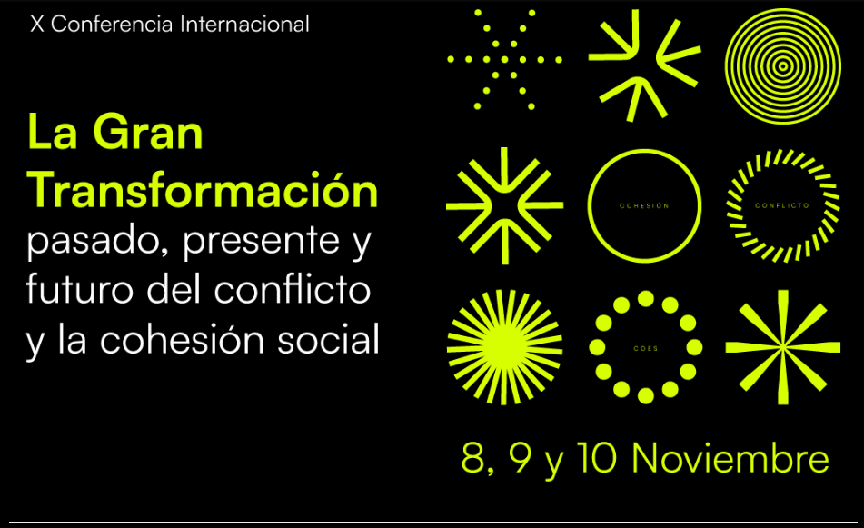
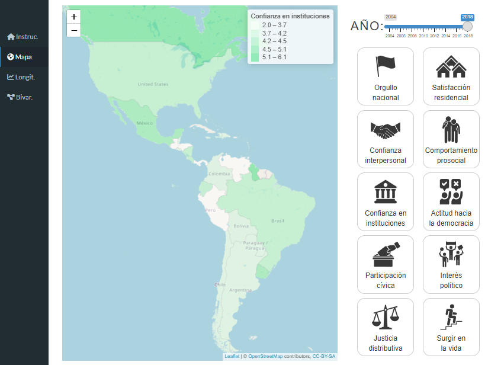

class: hide-logo title

```{r xaringanExtra, echo = FALSE}
  xaringanExtra::use_progress_bar(color = "red", location = c("top"))
```

.pull-left-narrow[

.center[




.tiny[
[bit.ly/cohesion-indicators](https://bit.ly/indicadores-cohesion)
]

]
]

.pull-right-wide[
.content-box-red[
.right[
# Conceptos, Medición e Indicadores de Cohesión Social

## Una perspectiva longitudinal
----

.medium[
<div style="line-height:150%;">
Juan Carlos Castillo*
<br> Ignacio Cáceres <br>
Kevin Carrasco
</div>
.small[
 *Departamento de Sociología, Universidad de Chile
 mail:[juancastillov@uchile.cl](juancastillov@uchile.cl) - [jc-castillo.com](https://jc-castillo.com)]   
]

]
]

]

???

---
background-color: black

.pull-left-narrow[
# .orange[**Contenidos**]
]

.pull-right-wide[

<br>


## .white[1- Qué es cohesión social?]

## .white[2- Operacionalización en encuestas internacionales]

## .white[3- Propuesta conceptual]

## .white[4- Implementación en ELSOC-COES
]
]

---
background-color: black

.pull-left-narrow[
# .orange[**Contenidos**]
]


.pull-right-wide[

<br>

## .red[1- Qué es cohesión social?]


## .gray[2- Operacionalización en encuestas internacionales]

## .gray[3- Propuesta conceptual]

## .gray[4- Implementación en ELSOC-COES
]
]


---
# Qué es cohesión social?

.center[
.red[Cohesión social]: _‘a quasi-concept, that is, one of those hybrid mental constructions that politics proposes to us more and more often in order to simultaneously detect possible consensuses on a reading of reality, and to forge them’’_ (p. 2).
]
<br>

.medium[Bernard, P. (1999). Social cohesion: A critique. Canadian Policy Research Networks.]

---
# Conceptos clave (1)

.center[
_"We believe that a good definition of social cohesion, just like any other concepts in the social sciences, should be judged in terms of two criteria: (1) .red[minimal] in scope and (2) close to .red[ordinary usage_]" (p.280).
]

<br>
.medium[Chan, J., To, H.-P., & Chan, E. (2006). Reconsidering Social Cohesion: Developing a Definition and Analytical Framework for Empirical Research. _Social Indicators Research_, 75(2), 273–302.
]

---
# Conceptos claves (2)

<br>

.center[
"_Social cohesion is a state of affairs concerning both the **vertical** and the **horizontal** interactions among members of society as characterized by a set of attitudes and norms that includes .red[trust], a sense of .red[belonging] and the willingness to .red[participate and help], as well as their behavioural manifestations_". (p. 290)
]
<br>

.medium[Chan, J., To, H.-P., & Chan, E. (2006). Reconsidering Social Cohesion: Developing a Definition and Analytical Framework for Empirical Research. _Social Indicators Research_, 75(2), 273–302.
]

---
background-color: black

.pull-left-narrow[
# .orange[**Contenidos**]
]


.pull-right-wide[

<br>

## .gray[1- Qué es cohesión social?]


## .red[2- Operacionalización en encuestas internacionales]

## .gray[3- Propuesta conceptual]

## .gray[4- Implementación en ELSOC-COES
]
]


---
# Proyectos internacionales de encuestas sobre cohesión social

* Mapping Social cohesion (Canada 1998)

* Scanlon-Monash Index of Social Cohesion (Australia 2007-2019)

* Social cohesion radar (Germany-International)

* Civic engagement and Social cohesion report (USA 2014)

* ECOsociAL (seven Latin American countries 2007)

???
Each of these studies has proposed different definitions of social cohesion, accompanied by different forms of operationalization. As a result, there are different dimensions, sub-dimensions and indicators that seek to measure social cohesion across these projects. Some of these dimensions are common among studies, but most of them present wide differences in their operationalization, combining indicators that in some studies are presented as sub-dimensions and in others constitute differentiated dimensions. As a result of conceptual differences, the nesting structure of dimensions and sub-dimensions is different between projects, which makes it difficult to make a direct comparison between the experiences reviewed. 


---
# Communalities / intersecciones
.pull-left[


]

.pull-right[

- Confianza en instituciones / Democracia

- Participación política

- Percepciones de justicia

- Sentido de pertenencia

- Calidad de vida en el vecindario

- Redes sociales
]

---
background-color: black

.pull-left-narrow[
# .orange[**Contenidos**]
]


.pull-right-wide[

<br>

## .gray[1- Qué es cohesión social?]


## .gray[2- Operacionalización en encuestas internacionales]

## .red[3- Propuesta conceptual]

## .gray[4- Implementación en ELSOC-COES
]
]

---
class: middle center

.center[]
---
class: middle center

.center[]

---
background-color: black

.pull-left-narrow[
# .orange[**Contenidos**]
]


.pull-right-wide[

<br>

## .gray[1- Qué es cohesión social?]


## .gray[2- Operacionalización en encuestas internacionales]

## .gray[3- Propuesta conceptual]

## .red[4- Implementación en ELSOC-COES
]
]

---
# Datos: ELSOC 2016-2023

- La población objetivo son hombres y mujeres entre 15 y 75 años de edad. Tiene representación de la población nacional urbana de más de 10.000 habitantes

- 6 olas hasta el momento

- N = 2.927 (primera ola)

- 15% Atrición promedio

- Mayor información: [coes.cl/encuesta-panel](https://coes.cl/encuesta-panel/)

---
.pull-left-narrow[
# Dimensión horizontal]
.pull-right-wide[

]

---
.pull-left-narrow[
# Dimensión Vertical]
.pull-right-wide[

]


---


---


---


---
class: inverse

.pull-left-narrow[
## .yellow[Agendas futuras]
]
<br>
.pull-right-wide[
- SES y Cohesión social

- Relación entre dimensiones vertical y horizontal

- Variables contextuales

- Investigaciones comparativas
]

---
class: inverse

.pull-left-narrow[
## .yellow[Agendas futuras]

.red[Visualizador Cohesión social en América Latina]

]
<br>
.pull-right-wide[

]

---


# Mayor información:

###[- coes.cl](https://coes.cl/)

###[- ocs-coes.netlify.app](https://ocs-coes.netlify.app/)

### [- github.com/ocscoes/medicion-cohesion-elsoc](https://github.com/ocscoes/medicion-cohesion-elsoc)


---
class: center middle

# Gracias por su atención!

Información de contacto:

Juan Carlos Castillo / juancastillov@uchile.cl - [jc-castillo.com](https://juancarloscastillo.github.io/jc-castillo/)

Departamento de Sociología - Universidad de Chile

.center[]
