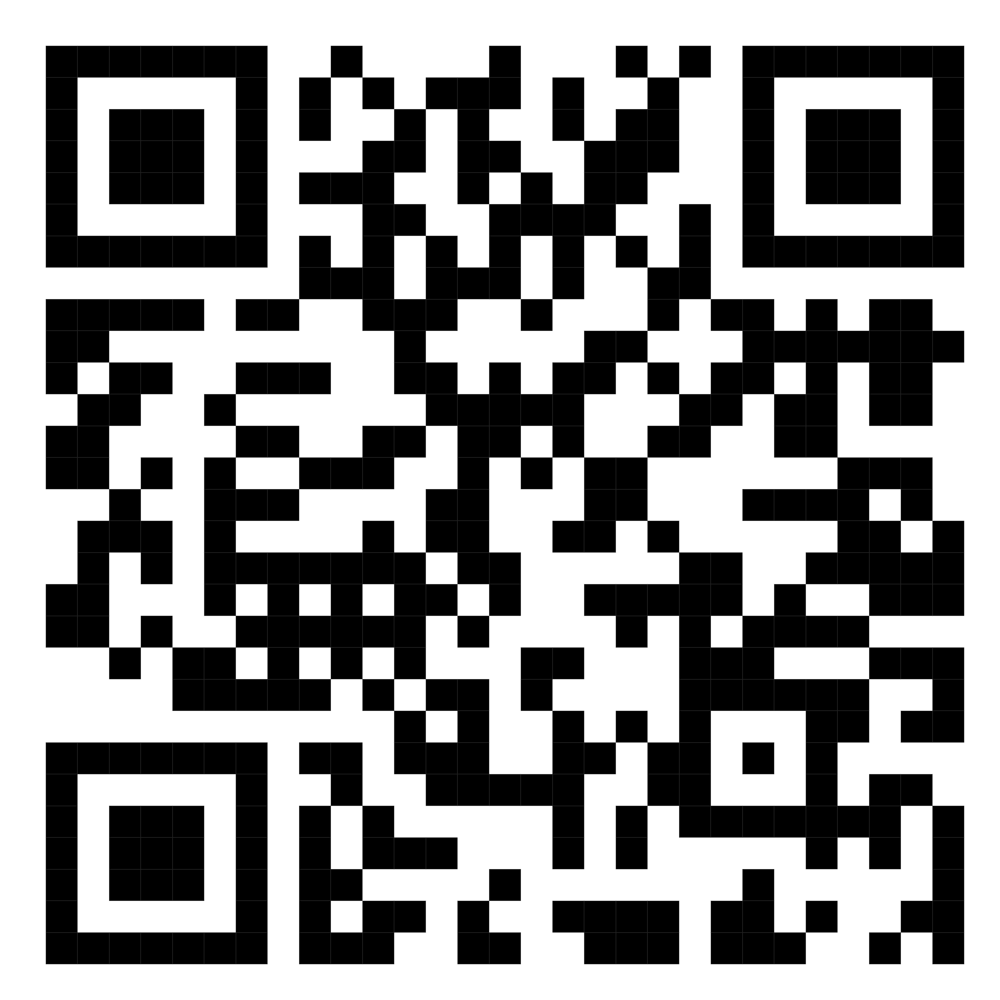
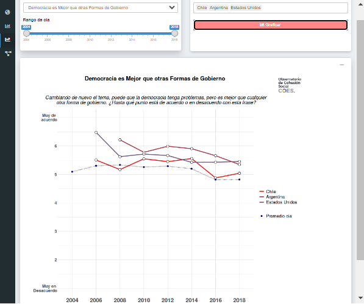
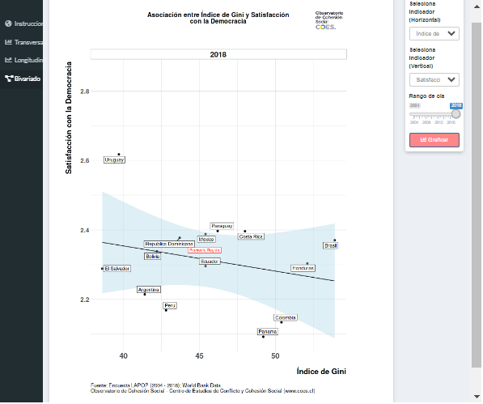
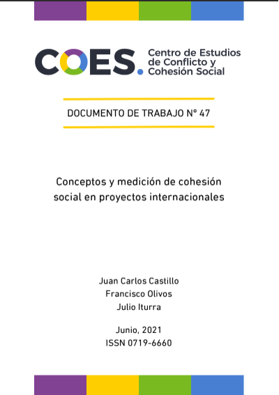
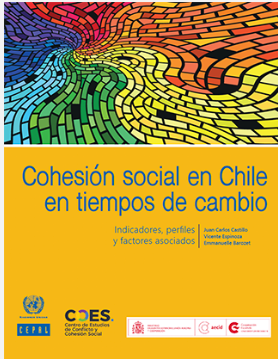
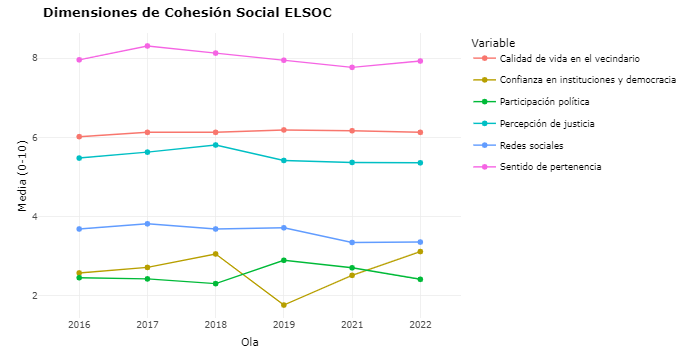

class: hide-logo title

```{r xaringanExtra, echo = FALSE}
  xaringanExtra::use_progress_bar(color = "red", location = c("top"))
```

.pull-left-narrow[

.center[




.tiny[
[https://ocs-coes.netlify.app/](https://ocs-coes.netlify.app/)
]
]
]
.pull-right-wide[
.content-box-red[
.right[
# Observatorio de Cohesión Social

----
.medium[
<div style="line-height:150%;">
Juan Carlos Castillo*

<br>

Kevin Carrasco
</div>
.small[
 *Departamento de Sociología, Universidad de Chile
 mail:[juancastillov@uchile.cl](juancastillov@uchile.cl) - [jc-castillo.com](https://jc-castillo.com)]   
]

]
]

]

???

---
background-color: black

.pull-left-narrow[
# .orange[**Contenidos**]
]

.pull-right-wide[

<br>


## .white[1- ¿Qué es el observatorio de cohesión social?]

## .white[2- Principales herramientas y resultados]

## .white[3- Proyecciones]

]

---
background-color: black

.pull-left-narrow[
# .orange[**Contenidos**]
]


.pull-right-wide[

<br>

## .red[1- ¿Qué es el observatorio de cohesión social?]

## .white[2- Principales herramientas y resultados]

## .white[3- Proyecciones]

]


---
class: reverse, center, middle

# ¿Qué es el observatorio de cohesión social?

El .red[Observatorio de Cohesión social] es un .blue[portal interactivo] que permite realizar análisis comparativos de distintos .blue[indicadores] asociados a cohesión social con foco en .blue[América Latina] entre 2004 y 2018.

Utiliza la base de la encuesta .blue[LAPOP] (Latin American Public Opinion Project), olas 2004, 2006, 2008, 2010, 2012, 2014, 2016 y 2018.

---
background-color: black

.pull-left-narrow[
# .orange[**Contenidos**]
]


.pull-right-wide[

<br>

## .white[1- ¿Qué es el observatorio de cohesión social?]

## .red[2- Principales herramientas y resultados]

## .white[3- Proyecciones]

]


---
# Principales herramientas y resultados
### [Visualizador de cohesión social](https://ocs-coes.netlify.app/app/)

.pull-left[

]

.pull-right[

]

---
# Principales herramientas y resultados
.pull-left-narrow[ .red[Conceptos y medición de cohesión social en proyectos internacionales]
]
.pull-right-wide[

]

---
# Principales herramientas y resultados
.pull-left-narrow[ .red[Hacia una propuesta de medición de Cohesión Social con ELSOC]
]

.pull-right-wide[

]

---
# Principales herramientas y resultados
.pull-left-narrow[ .red[Cohesión social en Chile en tiempos de cambio:]
Indicadores, perfiles y factores asociados
]

.pull-right-wide[

]

---
## Conceptos, medición e indicadores de cohesión social. Una perspectiva longitudinal

.pull-left-narrow[
## Dimensión horizontal]
.pull-right-wide[

]


---
## Conceptos, medición e indicadores de cohesión social. Una perspectiva longitudinal

.pull-left-narrow[
## Dimensión Vertical]
.pull-right-wide[

]

---
background-color: black

.pull-left-narrow[
# .orange[**Contenidos**]
]


.pull-right-wide[

<br>

## .white[1- ¿Qué es el observatorio de cohesión social?]

## .white[2- Principales herramientas y resultados]

## .red[3- Proyecciones]

]

---

# Proyecciones

.pull-left-narrow[.red[Visualizador Cohesión social en América Latina]
]

.pull-right-wide[

]

---
# Proyecciones

.pull-left-narrow[.red[Visualizador dimensiones de cohesión social en Chile con elsoc]
]

.pull-right-wide[

]
---


# Mayor información:

###[- coes.cl](https://coes.cl/)

###[- ocs-coes.netlify.app](https://ocs-coes.netlify.app/)

### [- github.com/ocscoes/medicion-cohesion-elsoc](https://github.com/ocscoes/medicion-cohesion-elsoc)


---
class: center middle

# Gracias por su atención!

Información de contacto:

Juan Carlos Castillo / juancastillov@uchile.cl - [jc-castillo.com](https://juancarloscastillo.github.io/jc-castillo/)

Departamento de Sociología - Universidad de Chile

.center[]
