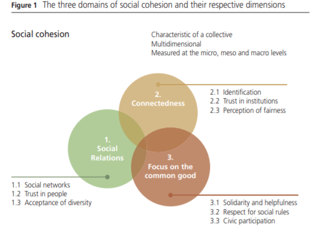
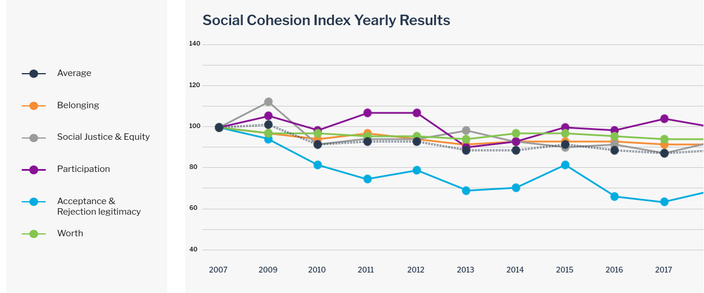

class: middle hide-logo title

```{r xaringanExtra, echo = FALSE}
  xaringanExtra::use_progress_bar(color = "red", location = c("top"))
```

.center[
# Concepts and measurement of social cohesion in international perspective

.medium[_3rd AS Conference: Cohesive Societies? Analytical-empirical Perspectives_]

.red[.medium[Juan C. Castillo (juancastillov@uchile.cl), Kevin Carrasco & Ignacio Cáceres] ]

<br>


.small[September 30th, 2021]

]

???

First of all, a few words about the research center in which this paper is framed.

The Center of Social Conflict and Cohesion Studies was born in 2013 funded by a grant of our national research agency ANID. We have four research lines covering socieconomic, interactional, political and territorial aspects of social conflict and cohesion. Currently there are about 50 researchers involved, who are academics from four of the largest universities in Chile.

Part of our efforts have been related with the conceptualization and measurement of social cohesion, and the present paper is part of this enterprise.

---
# COES & Social Cohesion

.pull-left-narrow[
<br>

]

.pull-right-wide[
- comparative indicators of [social cohesion in Latin America](https://ocs-coes.netlify.app/)

- working paper ["Concepts and Measurement of Social Cohesion in International perspective"](https://ocscoes.github.io/concepto-medicion/)

- changes in social cohesion in Chile 2016-2020 with our panel survey [ELSOC](https://coes.cl/encuesta-panel/) (paper in progress)

- this project
]

---
class: inverse middle center

# More information:

##[https://coes.cl/](https://coes.cl/)

##[https://ocs-coes.netlify.app/](https://ocs-coes.netlify.app/)

---
class: inverse center

## .red[How has social cohesion been conceptualized and measured in international comparative studies?]

--

## .yellow[What are the common dimensions accross studies?]

???
this is not a research paper, is mostly a review of social cohesion studies and an effort to find common aspects across them which allow us to propose a conceptual and measurement framework


---
class: roja
.pull-left-narrow[
# Steps
]

.pull-right-wide[
## 1. Identify studies
## 2. Describe dimensions
## 3. Identify communalities
## 4. A minimal proposal]

---
class: roja
.pull-left-narrow[
# Steps
]

.pull-right-wide[
## 1. .yellow[Identify studies]
## 2. Describe dimensions
## 3. Identify communalities
## 4. A minimal proposal]

---
# International survey research projects on social cohesion

* Mapping Social cohesion (Canada 1998)

* Scanlon-Monash Index of Social Cohesion (Australia 2007-2019)

* Social cohesion radar (Germany-International)

* Civic engagement and Social cohesion report (USA 2014)

* ECOsociAL (seven Latin American countries 2007)

???
Each of these studies has proposed different definitions of social cohesion, accompanied by different forms of operationalization. As a result, there are different dimensions, sub-dimensions and indicators that seek to measure social cohesion across these projects. Some of these dimensions are common among studies, but most of them present wide differences in their operationalization, combining indicators that in some studies are presented as sub-dimensions and in others constitute differentiated dimensions. As a result of conceptual differences, the nesting structure of dimensions and sub-dimensions is different between projects, which makes it difficult to make a direct comparison between the experiences reviewed. 

---
class: roja
.pull-left-narrow[
# Steps
]

.pull-right-wide[
## 1. Identify studies
## 2. .yellow[Describe dimensions]
## 3. Identify communalities
## 4. A minimal proposal]


---
## Example 1: Social cohesion radar

.center[

]

---
## Example 2: Scanlon-Monash index




---
# Common social cohesion dimensions/sub-dimensions

.pull-left[
* Sense of belonging
* Trust in institutions
* Perception of justice
* Political participation
* Focus on the common good
* Social trust
* Acceptance of diversity
* Social networks
]

.pull-right[
* Dignified treatment
* Satisfaction with life, happiness and expectations about the future
* Quality of social coexistence
* Perception of opportunities and social mobility
]

---
class: roja
.pull-left-narrow[
# Steps
]

.pull-right-wide[
## 1. Identify studies
## 2. Describe dimensions
## 3. .yellow[Identify communalities]
## 4. A minimal proposal]


---
# Communalities / intersections
.pull-left[


]

.pull-right[

- Trust in institutions/democracy

- Political participation

- Justice perceptions

- Sense of belonging

- Neighbourhood life quality
- Social networks
]


---
class: roja
.pull-left-narrow[
# Steps
]

.pull-right-wide[
## 1. Identify studies
## 2. Describe dimensions
## 3. Identify communalities
## 4. .yellow[A minimal proposal]
]

---

.center[

]

... and yet

---
# Conceptual keys


Chan, J., To, H.-P., & Chan, E. (2006). Reconsidering Social Cohesion: Developing a Definition and Analytical Framework for Empirical Research. _Social Indicators Research_, 75(2), 273–302.

--

_"We believe that a good definition of social cohesion, just like any other concepts in the social sciences, should be judged in terms of two criteria: (1) .red[minimal] in scope and (2) close to .red[ordinary usage_]" (p.280).

---
# Conceptual keys (2)

<br>

.center[
"_Social cohesion is a state of affairs concerning both the **vertical** and the **horizontal** interactions among members of society as characterized by a set of attitudes and norms that includes .red[trust], a sense of .red[belonging] and the willingness to .red[participate and help], as well as their behavioural manifestations_". (p. 290)
]

---
class: middle center

.center[]
---
class: middle center

.center[]

---
class: inverse middle

.pull-left-narrow[
# .red[Summing up]
]

.pull-right-wide[

- conceptualizing social cohesion: permanent endeavour

- different standards, dimensions, sub-dimensions and operationalizations

- a simplified model of horizontal and vertical social cohesion
]

---
class: center middle

# Thanks for your attention!

Contact info:

Juan Carlos Castillo / juancastillov@uchile.cl - [jc-castillo.com](https://juancarloscastillo.github.io/jc-castillo/)

Department of Sociology / Universidad de Chile

.center[]
