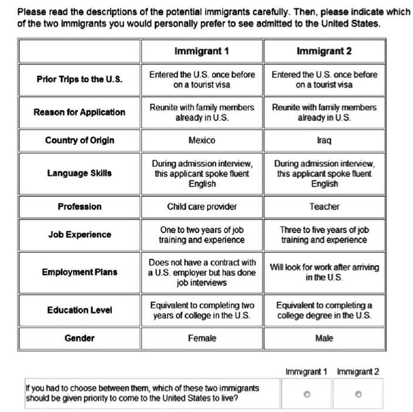
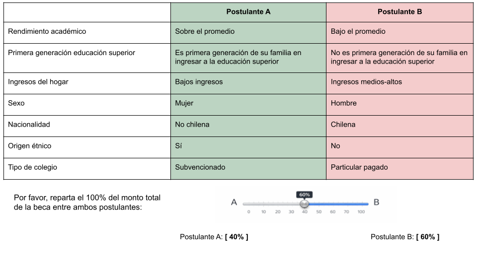

```{r}
#| label: setup
#| include: false
library(knitr)
knitr::opts_chunk$set(echo = F,
                      warning = F,
                      error = F, 
                      message = F) 
```

```{r}
#| label: packages
#| include: false

if (! require("pacman")) install.packages("pacman")

pacman::p_load(tidyverse, 
               sjmisc, 
               sjPlot, 
               sjlabelled, 
               here,
               kableExtra,
               ggdist,
               summarytools)

options(scipen=999)
rm(list = ls())
```


::: columns
::: {.column width="20%"}


:::

::: {.column .column-right width="80%"}


# Diseño Conjoint Survey Experiment


## Desigualdad y merecimiento en educación superior en Chile

-----------------------------------------------------------------------

::: {style="font-size: 75%;"}

Investigador Principal: Juan Carlos Castillo^1^

Asistentes de Investigación: Andreas Laffert^2^ y René Canales^2^

^1^ Departamento de Sociología, Universidad de Chile

^2^ Instituto de Sociología, Pontificia Universidad Católica de Chile

::: {.blue2}

FONDECYT N°1250518 - Justicia de mercado y merecimiento del bienestar social

:::

Workshop - Enfoques experimentales sobre redistribución y merecimiento

23 de enero, 2026

:::

:::
:::


# Contexto del proyecto {.xlarge data-background-color="#92220C"}

## Agenda de investigación

::: {.box-inv-4 .fragment .sp-after style="font-size: 100%;"}

Privatización y mercantilización de servicios sociales (salud, educación, pensiones) han reconfigurado las instituciones del bienestar [@gingrich_making_2011; @streeck_how_2016]

:::

::: {.box-inv-4 .fragment .sp-after style="font-size: 100%;"}

En Chile: profunda comodificación con alta desigualdad y bajo gasto social [@madariaga_three_2020; @ferre_welfare_2023]

:::

::: {.box-inv-4 .fragment .sp-after style="font-size: 100%;"}

Este orden económico se refleja en una economía moral específica/policy-feedback effects [@mau_inequality_2015; @campbell_institutional_2020; @fourcade_moral_2007] 

:::

::: {.box-inv-5 .sp-after-half .fragment style="font-size: 100%;"}

Preferencias por justicia de mercado [@busemeyer_skills_2015; @castillo_perceptions_2025; @koos_moral_2019; @lindh_public_2015; @immergut_it_2020]

:::

## Este proyecto

</br>

::: {.pull-left .box-inv-5 .sp-after .fragment style="font-size: 120%;"}

Abordar sistemáticamente las preferencias por criterios de mercado en salud, pensiones y educación, sus determinantes y cómo han cambiado en el tiempo en Chile


:::

</br></br>

::: {.pull-right .box-inv-5 .sp-after .fragment style="font-size: 120%;"}

Las preferencias por justicia de mercado se asocian a criterios de merecimiento fuertemente arraigados en la población → Marco CARIN [@oorschot_who_2000]

:::


#  {data-background-color="#92220C"}

::: {.incremental style="font-size: 130%;"}

**Objetivo**: Analizar en Chile (y en perspectiva comparada) el nivel y la evolución de las preferencias por justicia de mercado en las últimas dos décadas y su vínculo con criterios de merecimiento del bienestar

**Argumento**: El alto grado de comodificación del bienestar en Chile habría reforzado normas meritocráticas (especialmente el énfasis en el esfuerzo), elevando el apoyo a la justicia de mercado frente a países con menor comodificación

**Método**: Análisis de datos secundarios, levantamiento de datos y experimentos de encuestas

:::


## En esta ocasión...

::: {.box-inv-4 .fragment .sp-after style="font-size: 110%;"}

Diseño conjoint survey experiment [@hainmueller_causal_2014]

:::


::: {.box-inv-4 .fragment .sp-after style="font-size: 110%;"}

Objetivo: evaluar cómo criterios de merecimiento y de desigualdad afectan la asignación de becas para la financiar el primer año de educación superior en Chile

:::


::: {.box-inv-4 .fragment .sp-after style="font-size: 110%;"}

Merecimiento (CARIN): el acceso al bienestar es condicional según si las personas “merecen” beneficios (Control, Actitud, Reciprocidad, Identidad y Necesidad) [@oorschot_who_2000; @meuleman_welfare_2020]

:::

# Conjoint Survey Experiment {.xlarge data-background-color="#92220C"}

## ¿Qué es un conjoint?

::: {.incremental style="font-size: 110%;"}

- Experimento factorial que presenta **perfiles** construidos con múltiples **atributos** que varían simultáneamente [@hainmueller_causal_2014]

- Los encuestados evaluan perfiles (eligen o califican)

- Identificar qué atributos se consideran más relevantes cuando la decisión exige **ponderar múltiples criterios simultáneamente** [@bansak_conjoint_2021; @hainmueller_causal_2014]

- Diseñado para estudiar preferencias multidimensionales con trade-offs reales [@bansak_breaking_2021]

:::

---

<div style="text-align:center;">

</div>

## Elementos del diseño de conjoint

::: {.incremental style="font-size: 110%;"}

- **Escenario:** rol del encuestado y contexto de decisión

- **Tarea ($k$):** qué debe hacer el encuestado con la información

- **Atributos ($l$) y niveles ($D_l$):** características (tratamientos) que varían → (ej. Sexo: hombre/mujer)

- **Perfiles ($j$):** combinaciones aleatorias de niveles de los atributos

- **Respuesta:** discrete-choice o rating-choice

- **Aleatorización (asignación):** uniforme e independiente por niveles de los atributos

:::


## Inferencia causal en conjoint

:::: {style="font-size: 110%;"}

::: {.fragment}

### **Lógica causal:**

- Aleatorización de niveles ($D_l$) de cada atributo ($l$) → identificación causal

- Comparación **entre niveles** de un atributo, promediando sobre el resto

:::

::: {.fragment}


### **Supuesto clave**: 

$Y_{i}(t) \perp\kern-5pt \perp T_{ikjl}$ (aleatorización)

:::

::: {.fragment}
$T_{ijkl} \ \perp\kern-5pt \perp \{\,T_{ijk[-l]},\ T_{i[-j]k}\,\}$ (aleatorización completamente independiente)

:::

::: {.fragment}

### **Supuestos adicionales:**

- Estabilidad (no carryover), ausencia de efectos de orden, consistencia (SUTVA) y positividad
:::

::::


## Estimandos principales

:::: {.incremental style="font-size: 100%;"}

La elección del estimando depende de la pregunta: ¿comparativa/marginal o descriptiva en niveles? [@leeper_measuring_2020]


::: {.fragment}
Average Marginal Component Effect (AMCE):

- Cambio promedio en el resultado cuando un atributo pasa de un nivel de referencia a otro, manteniendo constante "en promedio" el resto de atributos (gracias a la aleatorización) [@hainmueller_causal_2014]

:::

::: {.fragment}
Otros estimandos:

- Marginal means (MM): nivel esperado de apoyo asociado a cada nivel del atributo (sin categoría de referencia)

- Efectos condicionales e interacciones (ACIE): si el efecto de un atributo depende de otro
:::
::::

## ¿Por qué conjoint?

::: {style="font-size: 100%;"}

Según @bansak_breaking_2021 y @hainmueller_causal_2014:
:::

::::: columns
::: {.fragment .column width="50%" style="font-size: 100%;"}

### Ventajas

- Captura decisiones multidimensionales con trade-offs reales 

- Eficiencia estadística: múltiples observaciones por encuestado/a 

- Reducción potencial de sesgo de deseabilidad social 

- Posibilidad de contrastar hipótesis rivales

:::

::: {.fragment .column width="50%" style="font-size: 100%;"}

### Limitaciones (solucionables)

- Masking, satisfacing y carga cognitiva

- La validez externa depende del universo de perfiles

- Efectos promedio pueden ocultar heterogeneidad relevante

:::
:::::

# Propuesta de diseño {.xlarge data-background-color="#92220C"}

## Objetivo del experimento

::: {.incremental .highlight-last style="font-size: 110%;"}

- Analizar cómo ciertos criterios de **merecimiento** y características de **desigualdad** afectan la distribución de recursos para financiar el acceso a la educación superior en Chile

- Aproximar un escenario de toma de decisiones: asignar un recurso escaso (beca) entre postulantes que difieren en múltiples características [@almas_experimental_2025]

- Identificar qué criterios (merecimiento o desigualdad) se consideran más relevantes para la decisión bajo un contexto de distribución y ponderación de múltiples atributos [@hainmueller_causal_2014]


:::

---

::: {.fragment style="font-size: 65%;"}

Imagine que usted fue seleccionado/a para integrar un comité que evalúa postulantes a una beca que financia el primer año de la educación superior en Chile.

En cada pantalla verá dos postulantes con información breve sobre sus características. En esta tarea, ambos tienen el mismo puntaje en la prueba de admisión a la educación superior (PAES): 650.

Su tarea es distribuir el 100% del monto total disponible ($3.000.000) entre ambos postulantes, de acuerdo con su criterio.

<div style="text-align:center;">
  
</div>

:::

## Atributos y niveles: Bloque CARIN

:::: {style="font-size: 100%;"}

::: {.fragment}


Los atributos operacionalizan 3 criterios de merecimiento (Control, Identity, Need) 
:::

::: {.fragment}

**Bloque CARIN:**

| Componente | Atributo | Niveles |
|------------|----------|---------|
| Control | Rendimiento académico | Sobre el promedio / Promedio / Bajo el promedio |
| Identity | Primera generación en educación superior| Sí / No |
| Need | Ingreso del hogar | Bajos ingresos / Ingresos medios-altos |
:::
::::

## Atributos y niveles: Bloque desigualdades

:::: {.fragment style="font-size: 100%;"}

**Bloque desigualdades:**

| Atributo | Niveles |
|----------|---------|
| Sexo | Hombre / Mujer |
| Nacionalidad | Chileno/a / No chileno/a |
| Pertenencia a pueblo indígena | Sí / No |
| Tipo de colegio | Municipal / Particular subvencionado / Particular pagado |

::::


## Aleatorización

:::: {.incremental style="font-size: 100%;"}

::: {.fragment}
**Orden de atributos:** aleatorizado por encuestado/a (se fija tras la primera tarea) para reducir primacía/recencia.
:::
::: {.fragment}
**Diseño:** aleatorización completa a nivel de perfil + **PAES fijo a nivel de tarea**.

- 7 atributos del perfil: asignación uniforme e independiente  
    
    * binarios: $p=0.5$ por nivel; 3 niveles: $p=1/3$
- Dos perfiles por tarea: $X_{tA}, X_{tB}$ generados y se impone $X_{tA}\neq X_{tB}$ 
- PAES: en cada tarea se fija $S_t$ y se asigna igual a ambos perfiles:  
  $(X_{tA},S_t)$ vs $(X_{tB},S_t)$
- Orden A/B: irrelevante (posición randomizada).
:::
::: {.fragment}
**Ventaja:** independencia entre atributos del perfil y resultados potenciales $\rightarrow$ identificación de AMCE [@hainmueller_causal_2014]
:::

::::

## Nº perfiles y tareas 

::: {.incremental style="font-size: 100%;"}

- **Atributos del perfil (7):** $|\mathcal{X}| = 3^2 \cdot 2^5 = 288$ perfiles únicos
- **Perfiles por tarea:** $J=2$ (Postulante A vs B)
- **Tareas por encuestado/a:** $k=5$
- **Atributo de tarea:** PAES $S_t$ fijo dentro de cada tarea (igual para A y B)
:::

::: {.fragment style="font-size: 90%;"}

### Espacio de pares posibles

- Por cada valor fijo de PAES:

$$
N_{\text{pares}\mid S}=\binom{288}{2}=41,328
$$

- En todo el diseño: 

$$
N_{\text{pares totales}}=P\cdot \binom{288}{2}
$$
:::

## Implementación

::: {.incremental style="font-size: 110%;"}

- **Generación por tarea $k$:** muestreo uniforme por atributo $\rightarrow$ 2 perfiles distintos $X_{tA}\neq X_{tB}$; fijar PAES $S_t$ común; randomizar posición A/B
- **Formato:** tabla (atributos en filas; postulantes en columnas) + slider 0–100% con restricción $A+B=100$
- **Muestra:** $N=1,500$ (CAWI) $\Rightarrow NT=7,500$ tareas; $2NT=15,000$ evaluaciones de perfil
- **Muestreo:** cuotas por edad, sexo, educación y NSE (encuesta online)

:::


# Próximos pasos {.xlarge data-background-color="#92220C"}

## Implementación y piloto

::: {.incremental .highlight-last style="font-size: 110%;"}

- **Programación del experimento** en plataforma de encuestas

- **Piloto (N ≈ 800):** evaluar tiempo, comprensión, patrones de respuesta, fatiga

- **Ajustes post-piloto:** número de tareas (K) y atributos (T), redacción de niveles, restricciones

- **Campo principal:** N ≈ 2.000, diseño muestral por cuotas

:::

## Discusión

::: {.incremental style="font-size: 110%;"}

**Trade-off: número de atributos y riesgo del experimento** 

- Carrera que quiere estudiar como reciprocidad

- Cómo incluir talento y esfuerzo

- Restricción por puntaje PAES (iguales entre perfiles)

- Criterios CARIN ¿dentro y/o fuera del experimento?

:::


# ¡Gracias por su atención!

-   **Github del proyecto:** <https://github.com/jus-mer>

## Referencias
